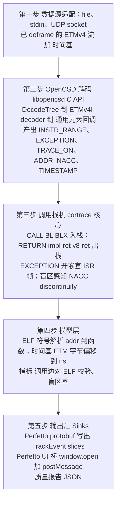
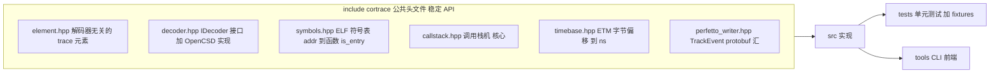
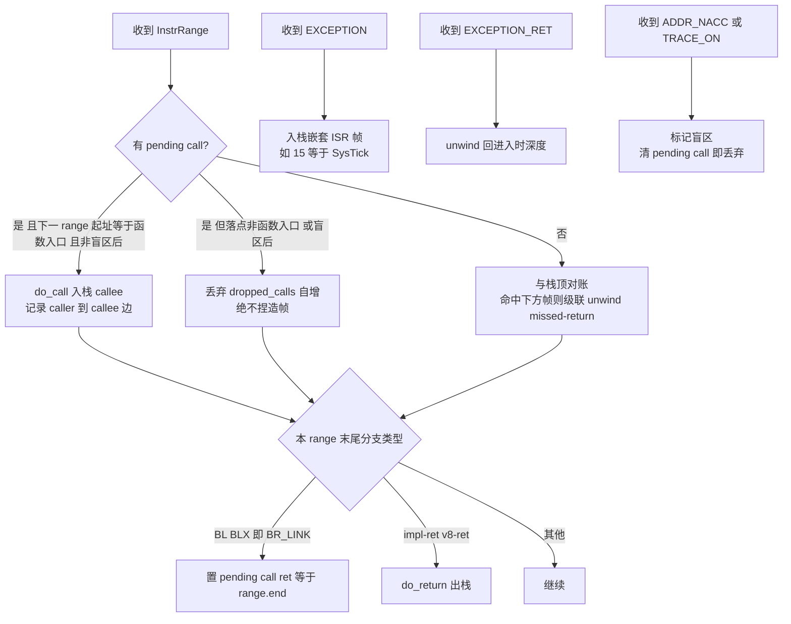
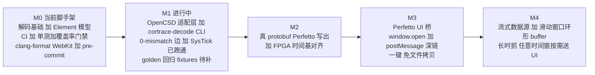

# Cortrace — 架构设计文档

日期：2026-09-16
状态：早期基础（解码核心 + CI/测试/格式化脚手架）

**Cortrace** 把 ARM CoreSight ETM trace 原始字节流转换成函数级
[Perfetto](https://ui.perfetto.dev) 时间线。它用 ARM/Linaro 官方参考解码器
[OpenCSD](https://github.com/Linaro/OpenCSD) 解码，重建调用栈，并（规划中）
一键推送到 Perfetto 网页端。

- **语言**：C++17 核心，Python/JS 薄工具层。
- **许可证**：MIT。

---

## 1. 为什么要做 Cortrace

现有方案（orbuculum + orbetto / Mortrall）复用了一个**精简版** ETMv4 解码器，
在采集质量边际的抓样上会出错：遇到损坏字节时，它带着**过时的程序计数器**继续行走，
捏造出多达 **4.6 倍**的真实指令数和数百次假函数重入。

而 ARM 官方参考解码器 **OpenCSD** 对同一条损坏流处理正确——它在 A-Sync / Trace-Info
处重新同步，把无法解码的区段如实标记为**地址不可达（NACC）**，而不是编造程序流。

Cortrace 的核心论点：**把最难、最容易出错的 ETM 解码外包给 OpenCSD，我们只拥有其上
确定性的层**——调用栈重建、时间基对齐、Perfetto 导出。一个约 260 行的原型已经产出了
与 ELF **逐条调用边完全一致（0 mismatch）** 的调用图，而现有工具在同一 slice 上产生了
大量捏造的调用边。

### 非目标（Non-goals）
- Cortrace **不做采集**。采集（FPGA / 探针）留在上游，我们只消费字节流。
- Cortrace **不重新实现 ETM 包解码**。那是 OpenCSD 的职责。

---

## 2. 数据流



---

## 3. 模块结构



目录约定：

```
cortrace/
├── include/cortrace/   公共头文件（稳定 API 面）
├── src/                实现（核心不依赖 OpenCSD）
├── tests/              零依赖单元测试 + 框架
├── tools/              CLI 前端（cortrace-decode …）
├── cmake/              CodeCoverage.cmake 等
├── scripts/            format.sh, install-hooks.sh
├── .githooks/          pre-commit（格式门禁）
└── .github/workflows/  ci.yml
```

### 3.1 解码层（`decoder.hpp`）
封装 OpenCSD C API（`ocsd_create_dcd_tree` / `ocsd_dt_create_decoder`
配 `OCSD_BUILTIN_DCD_ETMV4I` / `ocsd_dt_add_binfile_mem_acc` /
`ocsd_dt_set_gen_elem_outfn` / `ocsd_dt_process_data`）。它把 OpenCSD 的
`ocsd_generic_trace_elem` 归一化成 cortrace 自己的 `Element`，使上层**永远不直接依赖
OpenCSD 类型**——因此核心逻辑无需真实解码器即可单元测试（测试喂合成 `Element` 流）。

Cortex-M7 ETMv4 的**配置**来自目标的 `TRCIDR*` / `TRCCONFIGR` 寄存器
（架构 `ARCH_V7`，Profile `profile_CortexM`）。

### 3.2 调用栈机（`callstack.hpp`）—— 核心，全量单元测试
按顺序消费 `Element`，维护帧栈，产出 begin/end slice。

重建规则（源自原型，每条都有对应单测）：



- **CALL**：range 末尾是已执行的 `BR`/`BR_INDIRECT` 且子类型 `BR_LINK`。push 一帧；
  callee 身份由 BL 静态目标（产品级）或下一 range 入口（兜底）确定。记录 caller→callee 边。
- **RETURN**：已执行的 `BR_INDIRECT` 子类型 `V7_IMPLIED_RET` / `V8_RET` / `V8_ERET`。pop。
- **EXCEPTION**：开一个嵌套 ISR 帧，按异常号命名（15=SysTick / 14=PendSV / 11=SVCall /
  3=HardFault / 2=NMI / ≥16=外部 IRQ）；`EXCEPTION_RET` unwind 回进入时的深度。
- **盲区感知**：遇 `ADDR_NACC` / `TRACE_ON`（坏包 / 溢出重同步）时，跨越盲区的调用/返回
  信息已物理丢失，栈机**绝不捏造帧**——丢弃 pending call；当重新进入一个仍开着的
  非递归函数时，先弹出陈旧帧（级联 unwind）。

**不变量（测试断言）：**
1. begin 数 == end 数；最终深度 0（嵌套配平）。
2. 每条 caller→callee 边都对应 ELF 里真实的 `bl`（0 mismatch）。
3. 深度永不为负。
4. 指令数收敛到参考解码器水平（无过度行走）。

### 3.3 时间基（`timebase.hpp`）
采集侧对**原始 ETM 字节**打时间戳（`time.bin` 每字节一个 ns）。OpenCSD 为每个元素
报告其源字节偏移（`idx_sop`），因此 cortrace 通过查表把 元素 → ns。这是**频率无关**的
（不依赖 ETM cycle-count 包，那些包在 STALL 下会被抑制）。

### 3.4 Perfetto 汇（`perfetto_writer.hpp`）
产出 `Trace`（一串 `TracePacket`）：一个 `TrackDescriptor` + 若干 `TrackEvent` slice
（`TYPE_SLICE_BEGIN`/`END`、`track_uuid`、`name`、`timestamp`）。产品级链接真正的
protobuf 库；原型的手写编码器会被替换，但线格式已对照 Perfetto 参考 schema 验证过。

---

## 4. 质量指标（一等公民，不是事后补充）

Cortrace 把 trace 的**可信度**当作输出，而非脚注：

| 指标 | 含义 | 门禁 |
|------|------|------|
| **调用边对 ELF mismatch** | trace 中没有真实 `bl` 支撑的调用边 | 必须为 0 |
| **嵌套配平** | begin==end，最终深度 0 | 必须成立 |
| **盲区率** | 时间轴上无指令覆盖的占比（Σ NACC/discontinuity 时长 / 总跨度）| 报告；高=采集差 |
| **指令数 vs 参考** | 过度行走检测 | 容差内 |

**盲区率**是采集质量最直接的单一指标：它随采样眼裕度波动（同一次运行的两段 slice 实测
字节损坏率从 0.75% 变到 10%），因此 cortrace 对每条 trace 都给出盲区率，并可在其过高、
不足以信任时告警。

---

## 5. 路线图



---

## 6. 测试策略

- **单元测试**把合成的 `Element` 流喂进调用栈机——**无需真实解码器**，因此逻辑可隔离、
  确定性地测试。
- **集成测试**在少量签入的 ETM fixture 上跑 OpenCSD 后端，断言 §4 的质量指标。
- **覆盖率**用 gcovr，CI 中强制**最低行覆盖率门禁**（见 `CMakeLists.txt` / `ci.yml`），
  低于阈值构建失败。
- **golden 回归**：固定 fixture 的指标存档并 diff，任何让边匹配 / 盲区率退化的
  解码或栈改动都会被抓到。
