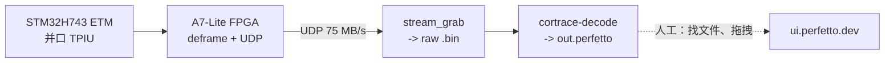
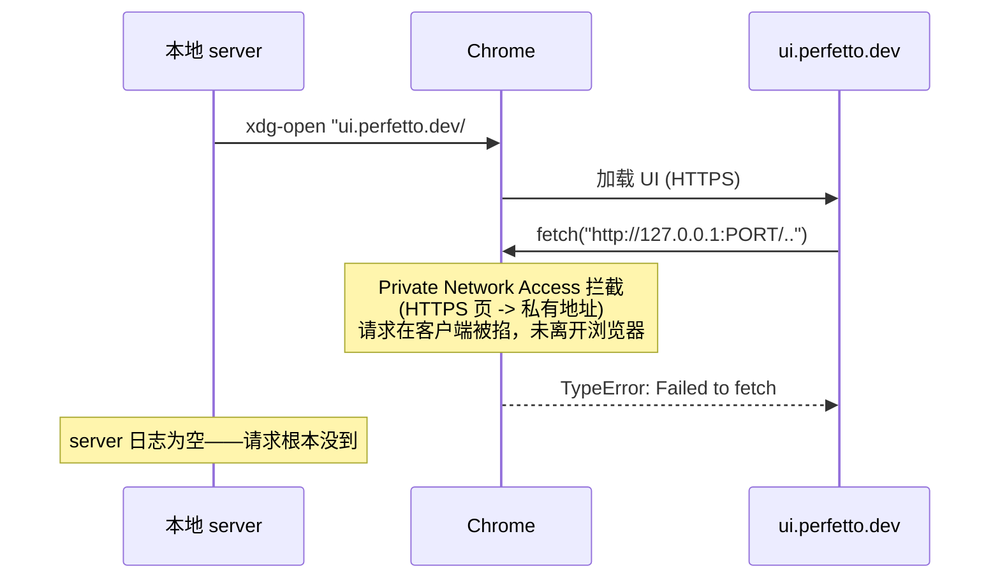
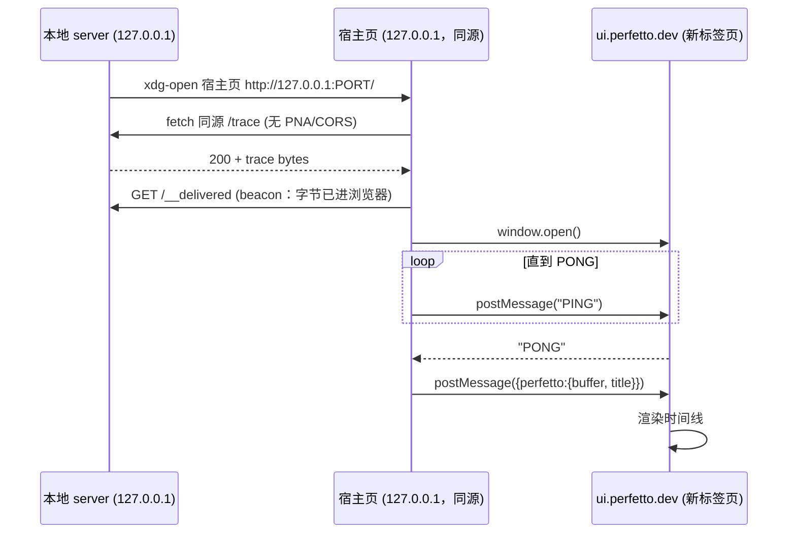
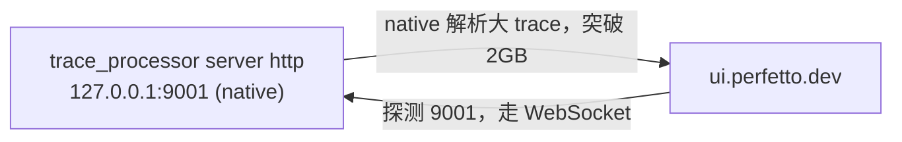
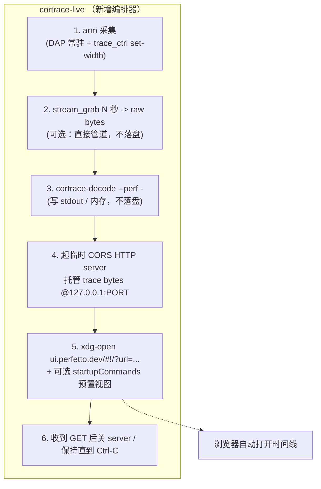
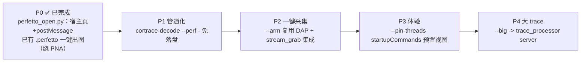

# Cortrace — Perfetto 一键实时可视化桥

日期：2026-09-16
状态：P0 已实现并上板实测（`scripts/perfetto_open.py`）；P1-P4 设计稿

把当前"抓包 → 解码成 `.perfetto` 文件 → 手动拖进 ui.perfetto.dev"的三步手工流程，
收敛成**一条命令 / 一次点击**：触发采集 → 解码 → 浏览器里自动打开 Perfetto 时间线，
全程不落地文件、不手动拷贝。本文评估 Perfetto 官方支持的本地通信协议，选定方案，
给出分阶段落地计划与接口契约。**不含实现代码，执行前需确认。**

---

## 1. 背景与问题

现有端到端链路（doc `cortrace-fpga/docs/01-nuttx-thread-profiling.md`）：



痛点全在最后一跳（虚线）：

- **手工拷贝**：`.perfetto` 落在 `perftrace/`，要手动定位、拖进网页。
- **多次迭代累**：调参数（`--cycle-time` / `--trace-width` / TCB map）后每次都要重拖。
- **大文件卡**：>几百 MB 的 trace，浏览器 WASM 版 TraceProcessor 吃满 2GB 内存会崩。

我们想要的是 TRACE32/J-Trace 那种"点一下 → 出图"的体感，但保留 ui.perfetto.dev
（零安装、始终最新）。

---

## 2. Perfetto 支持的本地通信协议（调研结论）

Perfetto UI 是**纯前端**应用（无自有后端），但官方提供了三条与本地程序对接的通道。
逐条评估：

### 2.1 Direct URL —— `#!/?url=`（本地 HTTP + CORS）——❌ loopback 上被 Chrome 否决

UI 支持 `https://ui.perfetto.dev/#!/?url=<TRACE_URL>`：页面加载后**自己 `fetch()`**
那个 URL 把 trace 拉进浏览器内存渲染。看似可指向本机临时 HTTP server，**但实测在现代
Chrome 的 loopback 场景不可行**（见下）。

官方要求写得很明确：**trace URL 必须是 HTTPS**（`Option 1: Direct URL for public
traces`）。指向 `http://127.0.0.1` 违反这一前提。



**实测否决（上板，Chrome 141）**：UI 报 `Could not fetch the trace ... TypeError:
Failed to fetch`，而本地 server 日志**完全为空**——请求在浏览器客户端就被拦，从未发出。

根因 = **Private Network Access（PNA，Chrome v130+）**：HTTPS 页面（`ui.perfetto.dev`）
向**私有地址**（`127.0.0.1`）发起的子请求，会在预检阶段被浏览器**客户端侧**阻断，且
**先于任何请求离开浏览器**。关键佐证：

- `curl` 能取到（curl 不做 PNA），但浏览器取不到 —— 证明不是 server/CORS 问题。
- 补齐 `Access-Control-Allow-Private-Network: true` 头**也无效** —— 阻断在客户端，响应头
  根本没机会被读到。
- 用 `--disable-features=PrivateNetworkAccessChecks,BlockInsecurePrivateNetworkRequests`
  启动 Chrome 后**立即成功**（server 收到 GET 200）—— 反证根因就是 PNA。

结论：**`#!/?url=` 指向 loopback HTTP 这条路在现代 Chrome 上死路**，且不能要求用户改
浏览器 flag。改用 §2.2 postMessage。

### 2.2 postMessage —— 本地宿主页 + `window.open` + `PING/PONG` ✅（选定，已实测）

本地 HTTP server 托管一个**宿主页面**（host page），并在**同一 origin**上托管 trace 文件。
宿主页 JS 做三件事：① 从**自己的 origin**（同源）`fetch()` trace 字节 —— **同源请求，
不触发 PNA/CORS**；② `window.open('https://ui.perfetto.dev')`；③ 反复 `postMessage('PING')`
直到 UI 回 `'PONG'`，再 post `{perfetto:{buffer, title}}` 把 **ArrayBuffer 直接塞进 UI**。

**为什么这样能绕开 §2.1 的 PNA 死路**：trace 字节是宿主页从**同源** loopback 取的
（同源不算 private-network 跨界），而送进 UI 走的是 **postMessage 内存通道**，不是网络
fetch —— **全程没有"HTTPS 页 → 私有地址"的跨域网络请求**，PNA 无从触发。



- ✅ **绕开 PNA**（同源 fetch + postMessage 内存通道），是 loopback 场景唯一稳的路。
- ✅ 数据只在浏览器内存 + 本地 server，不经任何外部服务；可设标题。
- ✅ 可脚本化：server 收到 `/__delivered` beacon 即知"字节已进浏览器"，可退出或 `--keep`。
- ⚠️ 弹窗拦截：`window.open` 非用户手势触发时 Chrome 会拦，宿主页需**降级为一个按钮**
  让用户点一下（已实现）。
- ⚠️ 宿主页不能从 `file://` 开（浏览器安全限制），故必须由本地 HTTP server 托管 —— 本就
  需要 server，无额外成本。

**已实测（上板，Chrome 141）**：`scripts/perfetto_open.py` 起宿主页 → 同源 fetch 8.4MB
trace → postMessage 送入 UI → 时间线正常渲染（含 `--nx-tcbmap` 补的线程名泳道）。server
日志完整可见 `GET / 200`、`GET /trace 200`、`GET /__delivered 204`，证明请求全部到达且成功
（与 §2.1 的空日志形成对照）。

### 2.3 TraceProcessor 原生加速 server —— `trace_processor server http`

官方 `trace_processor` 二进制起一个 native server（默认 `127.0.0.1:9001`）。
UI 打开时**探测 9001 端口**，发现后弹窗问是否用本地 WebSocket 加速器替代内置 WASM。
解析在本机原生跑，吃满整机 RAM、SSE 加速。



- ✅ **唯一能解大 trace 的方案**（突破浏览器 2GB；我们 75MB/s 抓 10s 就 ~750MB raw，
  解析后膨胀 2-4x 会撞墙）。
- ✅ 复用同一份 trace 免重复解析（`export perfetto` 归档）。
- ⚠️ 需额外下载 `trace_processor` 二进制；UI 里多一步"用加速器？"确认弹窗。
- 与 2.2 **正交**：可叠加——postMessage 打开 UI，同时后台挂 TP server 供大 trace 用。

### 2.4 结论：分层方案

| 方案 | 复杂度 | 无需拷贝 | loopback 可用 | 大 trace | 依赖 |
|------|:------:|:-------:|:------------:|:--------:|------|
| 2.1 Direct URL `#!/?url=` | 低 | ✅ | ❌ **被 Chrome PNA 否决** | ❌(2GB) | 无 |
| 2.2 postMessage + 宿主页 | 中 | ✅ | ✅ **实测通过** | ❌(2GB) | stdlib http |
| 2.3 TraceProcessor server | 中 | ✅ | ✅ | ✅ | `trace_processor` 二进制 |

**选型（修订）**：
- **主线 = 2.2 postMessage**：唯一在现代 Chrome loopback 场景稳定可用的路（2.1 被 PNA
  掐死，实测确认）。同源 fetch + postMessage 内存通道，零浏览器改动，可脚本化，仅依赖
  Python stdlib http。覆盖日常迭代（trace 几十~几百 MB）。
- **大 trace 档 = 2.3**：`--big` 开关切到 TraceProcessor server 路径（突破 2GB）。
- **弃用 2.1**：`#!/?url=` 要求 HTTPS trace URL，指向 loopback HTTP 触发 PNA 客户端阻断，
  无法在不改浏览器 flag 的前提下工作。

---

## 3. 目标架构

新增一个薄编排层 `cortrace-live`（Python，放 `cortrace-fpga/host/scripts/`，因为它编排
采集 + 解码 + 浏览器，横跨两仓的产物），把现有构件串起来：



关键设计点：

1. **流式免落盘**：`stream_grab | cortrace-decode --perf -`（decode 支持 `-` 写 stdout），
   trace bytes 直接进编排器内存的 buffer，`perftrace/` 落盘变成可选（`--save`）。
   → 需要 cortrace-decode 支持 `--perf -`（见 §5 改动点）。
2. **本地宿主页用 stdlib**（`scripts/perfetto_open.py`，已实现）：Python `http.server`
   同源托管宿主页 HTML + trace + `/__delivered` beacon，宿主页同源 fetch trace 再
   postMessage 送入 UI；收到 beacon 即知"字节已进浏览器"，可退出或 `--keep` 常驻供刷新。
3. **startupCommands 预置视图**：postMessage 打开 UI 时（或 `window.open` 的 URL 上）带
   `startupCommands`（URL-encoded JSON）自动 pin 线程轨、跑一条概览 query，省去手动操作。
4. **参数透传**：`--cycle-time/--sysclk-hz/--trace-width/--nx-*` 等 decode 参数原样透传，
   一处配置多处复用。

---

## 4. 命令行接口（草案）

```
cortrace-live [capture opts] [decode opts] [ui opts]

  # 采集
  --iface enxc8a36266dcae     收流网卡
  --secs 1.0                  抓包时长
  --width {4,2,1}             TPIU 端口宽度（同时设 FPGA + 提示 DAP 已配）
  --arm                       抓包前自动 arm（起/复用 DAP 常驻会话）
  --raw-in FILE               跳过采集，直接用已有 raw .bin（离线复现）

  # 解码（透传给 cortrace-decode）
  --elf nuttx --syms x.nm
  --cycle-time --sysclk-hz 150000000
  --nx-switch-stream 1 --nx-tcbmap map.txt

  # 可视化
  --open / --no-open          是否自动开浏览器（默认 open）
  --port 0                    宿主页 server 端口（0=随机空闲）
  --big                       改走 trace_processor server（大 trace）
  --pin-threads               注入 startupCommands 预置 Threads 轨视图
  --save PATH                 额外落盘一份 .perfetto（默认不落盘）
  --keep                      server 常驻（浏览器可刷新重取），Ctrl-C 退出
```

典型用法：

```bash
# 一键：arm + 抓 1s + 解码 + 开浏览器
./cortrace-live --arm --width 4 --secs 1 \
    --elf ../../../nuttx_test/nuttx/nuttx --syms /tmp/nuttx.syms \
    --cycle-time --sysclk-hz 150000000 --nx-switch-stream 1 --pin-threads

# 离线复现已有 capture
./cortrace-live --raw-in /tmp/o0_150m_4bit.bin --elf nuttx --syms x.nm \
    --cycle-time --sysclk-hz 150000000 --nx-switch-stream 1
```

---

## 5. 对现有代码的改动点

| 组件 | 改动 | 状态 |
|------|------|------|
| `cortrace/scripts/perfetto_open.py` | 宿主页 + postMessage 打开器（P0） | ✅ 已实现 |
| `cortrace/tools/cortrace_decode.cpp` | `--perf -` 写 stdout（或 `--perf-fd N`） | 待做（P1，免落盘管道） |
| `cortrace-fpga/host/scripts/cortrace-live` | **新增**编排器 | 待做（P2，串采集/解码/浏览器） |
| `cortrace-fpga/host/scripts/stream_grab.c` | 支持 `-`（stdout）输出 | 待做（P1，管道化） |
| `nxtrace_dap.cfg` | 无需改 | `--arm` 复用现有 proc |

P0 的 `perfetto_open.py` 已落地且不碰 C++ 核心；后续 `--perf -` 是唯一的 cortrace 核心
改动，其余都在 host 脚本层，风险低。

---

## 6. 易错点（实现时必看）

- **不要用 `#!/?url=` 指向 loopback**（§2.1）：现代 Chrome 的 Private Network Access 会在
  客户端阻断 HTTPS 页对私有地址的 fetch，请求根本不发出，`curl` 能过是假象。用 §2.2
  postMessage。
- **宿主页与 trace 必须同源**：postMessage 方案能绕开 PNA 的**前提**是宿主页从**自己的
  origin** fetch trace（同源不算 private-network 跨界）。别让宿主页去 fetch 别的 origin。
- **宿主页不能 `file://`**：浏览器安全策略拒 `file://` 的 window.open/postMessage，必须由
  本地 HTTP server 托管宿主页（本就需要）。
- **弹窗拦截**：`window.open` 非用户手势触发时会被拦，宿主页需降级成一个按钮让用户点一下
  （`perfetto_open.py` 已实现该降级）。
- **`Cross-Origin-Opener-Policy`**：宿主页**不能**带 `COOP: same-origin`，否则拿不到
  `window.open` 的 handle，postMessage 失效。
- **端口固定值冲突**：TraceProcessor 探测写死 `9001`；`--big` 模式端口不可改（UI 只探
  9001，多实例要 `Relax CSP` flag + `?rpc_port=`）。
- **trace bytes 生命周期**：宿主页异步 fetch，server 至少要活到 `/trace` GET 与
  `/__delivered` beacon 完成；默认模式应等 beacon 再关，`--keep` 常驻供刷新。

---

## 7. 分阶段落地



- **P0 ✅ 已完成（上板实测）**：`scripts/perfetto_open.py` 用宿主页 + postMessage，喂已有
  `.perfetto` 文件即一键在浏览器出图，消灭"手动拖文件"这个最大痛点。不碰 C++ 核心。
  过程中定位并绕开了 Chrome PNA（§2.1/§2.2）。线程名由解码侧 `--nx-tcbmap` 提供，与本
  脚本正交。
- **P1** 之后彻底免落盘。
- **P4** 独立，等 trace 真的变大再做。

### 7.1 P0 用法（已可用）

```bash
# 解码出 .perfetto（线程名需 --nx-tcbmap，先用 nx_tcbmap.py 从活板 dump）
cortrace-decode capture.bin syms.nm --elf nuttx --raw --trace-width 4 \
    --cycle-time --sysclk-hz 150000000 --nx-switch-stream 1 \
    --nx-tcbmap tcbmap.txt --perf out.perfetto

# 一键在浏览器打开（起宿主页 + postMessage，绕开 PNA）
python3 cortrace/scripts/perfetto_open.py out.perfetto
#   --keep       送达后常驻，可刷新/重开
#   --no-open    只打印宿主页 URL，不自动开浏览器
#   --port N     固定端口（默认随机空闲）
#   --timeout S  等待送达超时（0=永久）
```

若浏览器拦了弹窗，宿主页会显示一个按钮，点一下即打开 UI 并加载 trace。

---

## 8. 验收标准

1. `cortrace-live --raw-in <已知 capture> ...` 在默认浏览器自动打开正确的时间线，
   无需任何手动文件操作。
2. server 在 trace 载入后干净退出（或 `--keep` 常驻），无端口泄漏、无僵尸进程。
3. 解码参数与独立跑 `cortrace-decode` 结果字节一致（编排器不改变解码语义）。
4. `--pin-threads` 打开即见 Threads 轨已 pin、概览 query 已跑。
5. 大 trace（>1GB raw）走 `--big` 能在 TraceProcessor server 下打开而浏览器不崩。

---

## 9. 参考

- Perfetto — Deep linking to the Perfetto UI（`#!/?url=`、postMessage、startupCommands）。
- Perfetto — Embedding the Perfetto UI（PING/PONG postMessage 协议）。
- Perfetto — Visualising large traces（`trace_processor server http`，9001 探测）。
- Chrome — Private Network Access（HTTPS→私有地址子请求的客户端阻断；`#!/?url=` 指向
  loopback 失败的根因）。
- 内容依据官方文档整理转述，已按许可要求改写。
