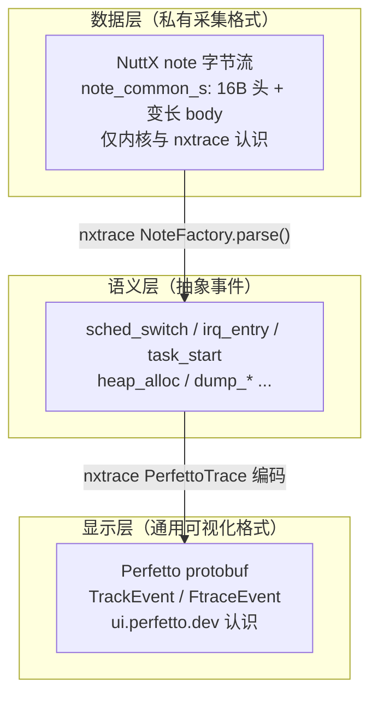
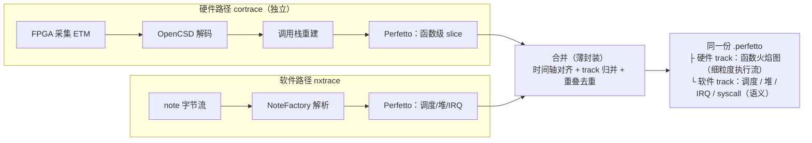
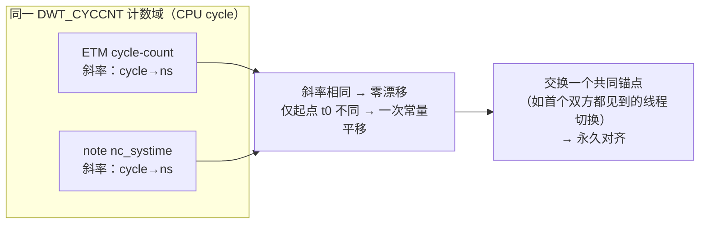
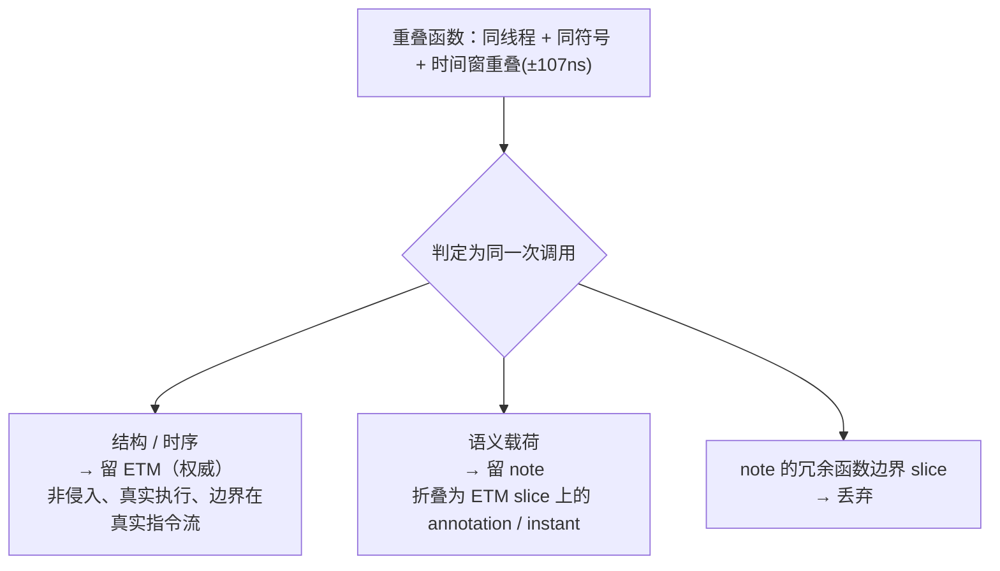
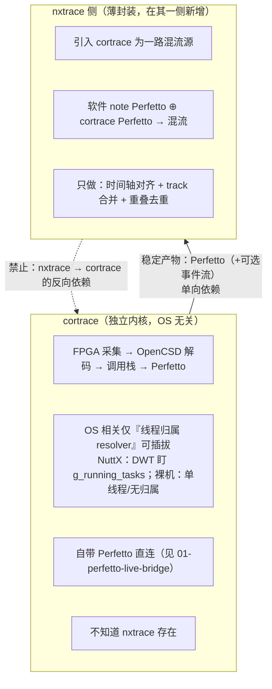
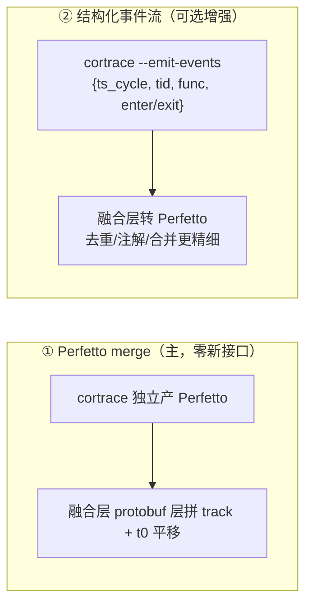

# Cortrace 与 nxtrace 融合方案

日期：2026-09-16
状态：设计稿（未实现）

评估 cortrace（硬件 ETM trace）与 NuttX nxtrace（软件 note trace）的异同，
论证两者在 Perfetto 显示层融合的可行性、时钟对齐机制、重叠事件取舍规则，并划定
职责边界与依赖方向。结论：**cortrace 保持独立、OS 无关；nxtrace 侧以薄封装引入
cortrace 作为一路混流源；融合只做时间轴对齐 / track 合并 / 重叠去重三件事，不做
数据处理。** 本文只定方案，执行前需确认。

---

## 1. 背景：两套 trace 的定位

存在两条独立的 trace 采集路径，各有不可替代的能力：

- **硬件 ETM trace（cortrace）**：并口 ETM → FPGA 采集 → OpenCSD 解码 → 调用栈重建
  → Perfetto。**非侵入**（设备侧零 trace 代码，配置全在调试器/FPGA 侧），自动抓
  **每一个函数**的执行流，是"系统实际怎么跑"的客观记录。
- **软件 note trace（nxtrace）**：内核 `SCHED_INSTRUMENTATION` 埋点 → note 字节流
  → 经 serial/udp/9pfs 等通道 → 解析 → Perfetto。**侵入**（需内核配置与埋点），但能
  拿到硬件看不到的**软件语义**：堆分配、IRQ、syscall、自定义 dump/printf/counter。

两者不是竞争关系，而是**互补的两层视图**。本文论证如何把它们叠到同一时间轴上。

---

## 2. 澄清：note 字节流 ≠ Perfetto

融合讨论中最易混淆的一点：NuttX note 与 Perfetto 是**不同的层**，不是同一种东西。

要点：

- **note 是私有采集格式，Perfetto 是通用显示格式。** note 只在数据层，Perfetto 在显示层。
- **cortrace 直接产 Perfetto**（TrackEvent），已经在显示层终点。
- 因此"把 cortrace 输出转回 note 再让 nxtrace 解析上来"是**降级与倒退**：把已在显示层的
  数据退回私有数据层，再重复解析一遍。**融合不走这条路。**

**正确方向**：两条流各自独立产出 Perfetto，在显示层合并为同一 trace 的不同 track。

---

## 3. 融合模型：显示层合并为互补 track

Perfetto 原生支持一个 trace 内多个 track。两条流都是合法 Perfetto packet，拼在一起即得
互补的两层视图：硬件流提供 note 给不了的**函数级执行流**，note 提供硬件看不到的
**软件语义**。

---

## 4. 时钟对齐：同源硬对齐

融合成立的前提是两条流能对到同一时间轴。结论：**在 ARMv7-M（Cortex-M7，如 STM32H743）
上两者时钟同源，硬对齐。**

### 4.1 同源论证

- NuttX note 时间戳 `nc_systime` ← `perf_gettime()` ← `up_perf_gettime()`。
- ARMv7-M 的 `up_perf_gettime()` 实现即 `getreg32(DWT_CYCCNT)`（`arch/arm/src/armv7-m/arm_perf.c`）。
- cortrace 的 ETM cycle-count 时间基同样数 **CPU cycle**，与 DWT CYCCNT 为同一计数域。

两条流的时钟**物理上是同一个 CPU cycle 计数器**，用同一个 `sysclk-hz` 换算 ns。文档所述
"跨时钟对齐"问题在此不存在——两者同在一颗 MCU、共用 DWT。

### 4.2 对齐 = 一次平移

- **斜率**（cycle→ns）两边完全一致 → 不随时间漂移。
- 仅**起点 t0** 可能不同 → 一次常量平移即对齐，非变速。
- 锚点：约定一个双方都能观测的事件（如首次线程切换），或一个已知 cycle 戳，交换一次偏移。

### 4.3 分辨率 ≠ 对齐偏差

cortrace 的时间量子约 **107 ns**（`TRCCCCTLR=0x10`，每 16 cycle @150MHz 发一个 cycle-count
锚点）；note 精确到 cycle（~6.67 ns，直接读寄存器）。**这是各自事件的定位粒度，不是两条
轴之间的偏差。**

| 维度 | 含义 | 对融合的影响 |
|------|------|------------|
| 斜率（速率） | cycle→ns，两边同源 | 零漂移，永久对齐 |
| 起点 t0 | 计数起点 | 一次平移消除 |
| 分辨率 | 事件落点的量化粒度（ETM ~107ns / note ~cycle） | 只影响**事件互证时的容差窗**，不影响轴对齐 |

事件级互证（同一次线程切换在两条流都出现）容差窗 ~107 ns，远小于线程/中断的 µs~ms 时间
尺度 → 对不上的风险为零。若将来需更细，可降 `TRCCCCTLR` 到 CCITMIN=4（~27 ns），代价是
带宽上升；对本融合目标 107 ns 已充分。

---

## 5. 重叠事件取舍

### 5.1 常态：不重叠

nxtrace 的 note 处理器集合（调度 / 中断 / 堆 / dump）中，**只有手动 `NOTE_DUMP_BEGIN/END`
埋点（或 `-finstrument-functions` 编译钩子）能产生函数 slice**；note 没有"自动每函数"能力。
而 cortrace 自动抓每一个函数。因此：

| 场景 | 硬件 ETM | 软件 note | 是否重叠 |
|------|:--------:|:---------:|:--------:|
| 未手动埋点（常态） | 全部函数 | 仅 sched/irq/heap | **无重叠，纯互补** |
| 手动埋了某函数 | 该函数（自动） | 该函数（埋点） | 重叠 |

**多数情况无重叠**，两条流各说各的，不存在"留谁"的问题。重叠只发生在显式标注过的
少数函数上。

### 5.2 重叠时：留硬件骨架 + note 语义注解

即便重叠，两者测的也不是同一件事：

- **ETM**：在真实指令 waypoint 抓函数进/出——非侵入、真实执行，时间量化 ~107 ns。
- **note**：在函数体内埋点宏处读 DWT_CYCCNT——精确到 cycle，**但**测点是埋点宏位置（偏了
  prologue + 宏开销）、note 写入本身**扰动被测系统**（侵入）、可携带 ETM 给不了的
  **语义载荷**（printf 参数、counter 值、自定义 data）。

取舍规则：

- 去重匹配键：`同一线程 + 同一函数符号 + 时间窗重叠(±107ns)`。
- **ETM 作骨架**（客观真实执行），**note 只贡献其独有语义数据作为注解**，重复 slice 丢弃。
- 原则：冲突时以客观硬件记录为准，软件埋点降级为附注。这与"硬件 trace 是 ground truth、
  note 是软件语义补充"的定位一致。

---

## 6. 职责边界与依赖方向

铁律（保证"薄封装"不长成"厚耦合"）：

1. **依赖单向**：nxtrace → cortrace。cortrace 永不反向依赖 nxtrace，连 note 格式都无需知道。
2. **cortrace OS 无关**：内核（ETM 解码 + 调用栈）与 OS 无关；OS 相关只在可插拔的线程归属
   resolver。裸机即"无归属"。
3. **薄封装只做三件事**：时间轴对齐、track 归并、重叠去重。不碰解码、不碰调用栈、不做
   数据处理。

---

## 7. 接口契约

cortrace 吐给融合层的形态有两种，主/辅并存：

- **① Perfetto merge（主路径）**：cortrace 走既有 Perfetto 输出，融合层把它当一路 Perfetto
  做 merge（拼 track + 一次 t0 平移）。**零新接口**，覆盖日常混流。去重在 Perfetto 层进行。
- **② 结构化事件流（可选）**：需要精细去重/注解时，cortrace 新增一个 OS 无关的
  `--emit-events` writer，导出未渲染的语义事件（本质是内部 `Element` 的薄序列化，约数百行）。
  融合层拿未渲染事件做去重与注解更干净。**这是唯一可能新增的对外接口**，且对 nxtrace 无感。
- **③ 作为 Python 库被 import**：不采用——把 C++ 内核绑进 Python 进程违背独立性。

**对齐锚点契约（①②通用）**：双方约定以 **DWT_CYCCNT + sysclk-hz** 为共同时间基，交换一个
t0 锚点（如首个双方都观测到的线程切换）。这是唯一的跨界约定。

---

## 8. 三方能力对比

| 维度 | 硬件 ETM（cortrace） | 软件 note（nxtrace） |
|------|:--------------------:|:--------------------:|
| 采集侵入性 | 零（设备侧无 trace 代码） | 需 `SCHED_INSTRUMENTATION` + 埋点 |
| 函数流 | 自动抓全部函数 | 仅手动埋点/编译钩子 |
| 软件语义（堆/IRQ/syscall） | 无 | ✅ 原生 |
| ETM 解码正确性 | OpenCSD（ARM 官方参考，坏流重同步/NACC 标记） | 自研纯 Python（坏包 guesswork 续走） |
| 时间基 | ETM cycle-count（DWT 域，~107ns 粒度） | note nc_systime（DWT 域，~cycle 粒度） |
| OS 依赖 | 无（线程归属可插拔） | NuttX 专属 |
| 显示 | Perfetto | Perfetto |

融合把两列的✅并起来：硬件出**完整非侵入函数流**，软件出**内核语义**，时钟同源叠同一轴。

---

## 9. 落地要点

- **默认路径**：走接口①，cortrace 独立产 Perfetto，融合层 merge。无需改 cortrace 内核。
- **精细混流**：需要时加接口② `--emit-events`（OS 无关、可选、单测可覆盖）。
- **对齐实现**：同源 DWT，一次 t0 平移；事件互证容差窗 ~107 ns。
- **去重实现**：`线程+符号+时间窗` 匹配，ETM 留骨架、note 留语义注解、冗余 slice 丢弃。
- **验证思路（PoC）**：同一次运行，DAP 抓 ETM（cortrace 路径）+ NuttX 开
  `SCHED_INSTRUMENTATION` 经 RTT/串口吐 note，两边各转 Perfetto，用 DWT_CYCCNT 锚点合并，
  检验 note 的 `sched_switch` 与 cortrace 的 DWT 线程切换包是否在 ~107 ns 窗口内重合
  （这本身即一次交叉验证）。

---

## 10. 结论

- **cortrace 保持独立、OS 无关、自带 Perfetto 直连**，不感知 nxtrace。
- **融合在 Perfetto 显示层做**，两条流合并为互补 track，而非把硬件输出降级回 note。
- **时钟同源硬对齐**：note 与 ETM 同用 DWT_CYCCNT，只差一次 t0 平移；107 ns 是事件粒度、
  非轴偏差。
- **重叠取舍**：常态不重叠；重叠时 ETM 作骨架、note 贡献语义注解、冗余 slice 丢弃。
- **依赖单向 + 薄封装只做对齐/合并/去重三件事**，是防止耦合蔓延的铁律。
