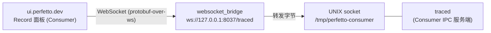
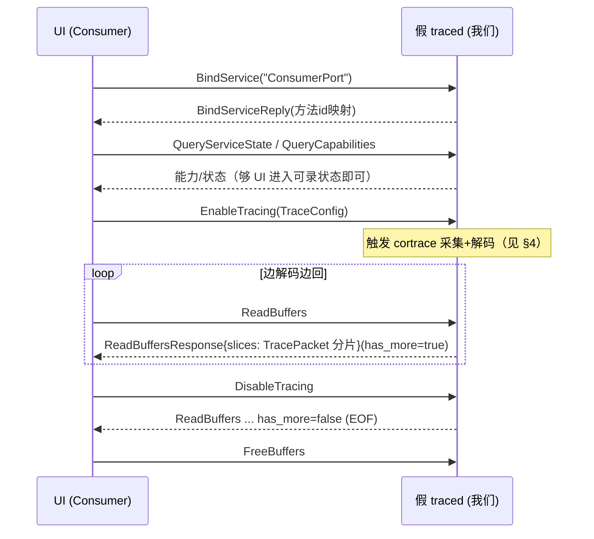
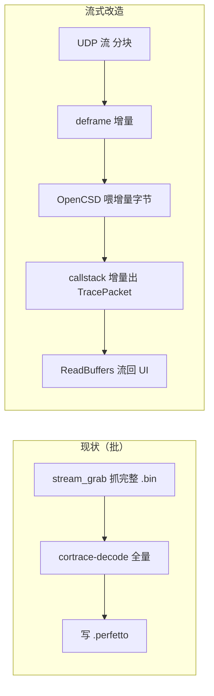
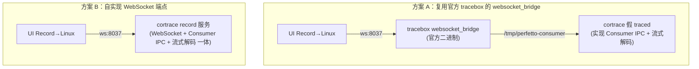
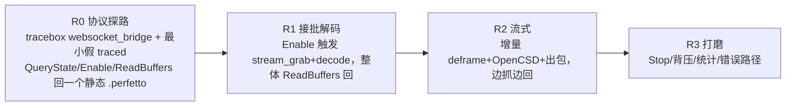

# Cortrace — Perfetto Record 直连桥（流式，设计文档）

日期：2026-09-16
状态：设计稿（未实现）

让 ui.perfetto.dev 的 **Record new trace** 面板能直接连到 cortrace：用户在 UI 里点
**Record → Start**，即触发本机的硬件 ETM 采集 + 解码，trace 实时流回 UI 渲染，全程不产生
中间文件、无需命令行。评估其机制、实现路径、工作量与取舍。**本文只定方案，执行前需确认。**

> 关系：这是 `01-perfetto-live-bridge.md` 的进阶。那篇的 P0/P2（postMessage + `cortrace_live`
> 一条命令出图）已上板可用，属"**先抓后看**、命令行发起"。本篇解决"**UI 里点 Record 发起、
> 边抓边看**"的流式场景，是最高的交互目标，也是最大的工程量。

---

## 1. 目标与非目标

**目标**：ui.perfetto.dev 的 Record 面板选一个 target，点 Start，本机 cortrace 开始采集
硬件 ETM + 解码，TracePacket 流实时回 UI；点 Stop 结束。体验对齐 nxtrace 的
"Record → Linux → Start"。

**非目标**：不追求覆盖 Perfetto 全部 record 能力（多 data source、trigger、clone 等）；
只实现让 UI record 流程跑通的**最小协议子集**。

---

## 2. Perfetto Record 的连接机制（调研结论）

UI 的 Record 面板不是"UI 主动去抓"，而是**UI 作为 Consumer 连到一个 tracing service
(traced)**，通过 **Consumer IPC 协议**下发配置、启停、读缓冲。对非 Android 目标
（Linux target），连接链路是：

关键事实（来自官方 issue #1006 的桥日志 + consumer_port.proto）：

- UI 连 `ws://127.0.0.1:8037/traced`。
- `websocket_bridge` 只是**字节转发**：WebSocket ⟷ UNIX socket `/tmp/perfetto-consumer`。
  它不理解 trace 内容。
- `/tmp/perfetto-consumer` 后面必须有一个说 **Consumer IPC 协议**的服务端（真 traced，
  或我们的**假 traced**）。桥连不上这个 socket 就报 `Connection to /tmp/perfetto-consumer
  failed`。

**推论**：要让 UI 的 Record 连到我们，**不需要假 ADB**（那是 Android target 的路，还要模拟
adb server + forward，更重）。**Linux target + websocket_bridge + 一个假 traced 监听
`/tmp/perfetto-consumer`** 才是最短路径。

---

## 3. 要实现什么：假 traced 的 Consumer IPC 子集

Consumer IPC = **protobuf-over-socket**，两层：

1. **外层 IPC framing**（`ipc/wire_protocol.proto` 的 `IPCFrame`）：连接握手
   （`BindService` → `BindServiceReply` 给出方法名→id 映射）、`InvokeMethod` /
   `InvokeMethodReply`（带 request_id、method_id、payload、`has_more` 流标志）。
2. **内层 ConsumerPort 方法**（`ipc/consumer_port.proto`）。

UI 的 record 流程实际只用到其中一个**最小子集**：

必须实现的方法（其余可返回空/存根）：

| 方法 | 作用 | 我们的实现 |
|------|------|-----------|
| `QueryServiceState` | UI 探测服务/数据源 | 返回一个含单个 data source 的最小状态 |
| `QueryCapabilities` | 特性协商 | 返回基础能力位 |
| `EnableTracing` | 收 `TraceConfig`，开始 | 触发采集+解码流水线（§4） |
| `ReadBuffers` | **流式**回 TracePacket | 把解码出的 packet 切片流回，`has_more` 控制 EOF |
| `DisableTracing` | 停止 | 停采集，flush 尾包 |
| `FreeBuffers` / `GetTraceStats` | 清理/统计 | 存根 + 简单 buffer 用量 |

- **TracePacket 复用现有**：cortrace 已产 Perfetto `TrackEvent`/`FtraceEvent` 包（见
  `perfetto_writer`）；这里只是把"写文件"改成"经 ReadBuffers 流出"。
- **TraceConfig 大部分可忽略**：我们不是通用 traced，只需读 buffer 大小/时长等少数字段，
  其余忽略。

---

## 4. 把离线批解码改造成流式

当前 cortrace 是**批处理**：抓完整个 raw → 一次性 OpenCSD 解码 → 写完整 perfetto。Record
要求**边抓边解边回**。这是本方案的第二个工程重点。

改造点与难度：

- **deframe 增量**：`deframe.cpp` 已是相位锁定 + 逐帧重组，天然可增量喂（保留跨块尾部），
  改造较小。
- **OpenCSD 增量**：OpenCSD 的 C API 本就是**流式喂字节**（`TraceDataIn` 分块），cortrace
  当前是一次性喂整块，改成分块喂即可。**这一层适配成本低**。
- **callstack/timebase 增量出包**：callstack 机是顺序消费 Element 的，本就增量；把
  perfetto_writer 从"末尾一次性 flush"改成"边生成边吐 packet"。中等改造。
- **时间基**：cycle-count 时间基是相对累积，流式下 t0 取第一个 cycle 锚点即可，无额外难点。

**难点不在解码本身**（OpenCSD 本就流式），**而在把整条流水线的"批"接口改成"流"接口 +
背压管理**（UI ReadBuffers 的节奏 vs 解码产出的节奏）。

---

## 5. 架构：两种落地形态

- **方案 A（推荐）**：复用官方 `tracebox`（下载即用）的 `websocket_bridge` 做 ws↔UNIX 转发，
  我们只实现 `/tmp/perfetto-consumer` 端的**假 traced**。职责最小、WebSocket/HTTP 那套不用碰。
  代价：多一个 tracebox 二进制依赖。
- **方案 B**：自己实现 WebSocket 服务端（`ws://…/traced`），把 ws framing + Consumer IPC +
  流式解码做一体。省掉 tracebox 依赖，但要自己处理 WebSocket 协议、CORS/Origin（UI origin
  是 `https://ui.perfetto.dev`）。工作量明显更大。
- **取舍**：先走 **A** 验证协议链路（tracebox 成熟、少踩坑），跑通后若想去依赖再考虑 B。

---

## 6. 工作量与风险评估

| 模块 | 工作量 | 风险 |
|------|:------:|------|
| Consumer IPC framing（IPCFrame/BindService/InvokeMethod） | 中 | 协议细节多但有 .proto 明确定义 |
| ConsumerPort 最小方法子集（§3 表） | 中 | UI 版本演进可能微调期望，需对着实测调 |
| 流式解码改造（§4） | 中-大 | OpenCSD 流式喂本就支持；难在流水线接口与背压 |
| websocket_bridge（方案 A 复用 / B 自写） | A:小 / B:大 | B 要处理 ws + Origin |
| 与既有批路径共存（不回归 P0/P2） | 小 | 新增独立入口，不动现有解码核心 |

**总体：中等偏大**，且依赖 Perfetto **内部 IPC 协议**（`api-and-abi` 声明 protobuf-over-socket
ABI 长期稳定，风险可控，但仍是内部面）。相比 P0/P2 的"几百行脚本"，这是一个真正的服务组件。

---

## 7. 对比：三种可视化入口

| | P0 postMessage | P2 cortrace_live | P? Record 桥（本文） |
|---|---|---|---|
| 发起方 | 命令行/脚本 | 一条命令 | **UI 点 Record** |
| 时序 | 先抓后看 | 先抓后看 | **边抓边看（流式）** |
| 需实现协议 | 无 | 无 | Consumer IPC + 流式解码 |
| 工作量 | 已完成 | 已完成 | 中-大 |
| 依赖 | 无 | 既有件 | tracebox（方案A）/ 自写 ws（B） |
| 何时值得 | 日常默认 | 日常默认 | 要 UI 原生 Record 体验 / 对齐 nxtrace 生态 |

**结论**：Record 桥能实现"UI 点一下就流式抓"，技术上可行且路径清晰（websocket_bridge +
假 traced + 流式解码，**不需要假 ADB**）。但它是中-大工程，依赖 Perfetto 内部 IPC 协议。
建议**在 P0/P2 满足日常需求的前提下，作为独立里程碑推进**，且先走方案 A（复用 tracebox）
验证协议链路。

---

## 8. 分阶段落地（建议）

- **R0** 是关键探路：先让 UI 的 Record 能连上并收到**任意** trace（先回一个预生成的
  `.perfetto` 的 packet），**证明 Consumer IPC 链路通**，再谈流式。
- **R1** 把 EnableTracing 接到现有批解码（复用 `cortrace_live` 的采集+解码），一次性回。
- **R2** 才做真正的增量流式（§4）。
- 每阶段可独立验证，风险前移。

---

## 9. 参考

- Perfetto — `protos/perfetto/ipc/consumer_port.proto`（ConsumerPort 方法定义）。
- Perfetto — `protos/perfetto/ipc/wire_protocol.proto`（IPCFrame 外层 framing）。
- Perfetto — Service model / traced（Consumer/Producer 架构）。
- Perfetto — API and ABI stability（protobuf-over-socket ABI 长期稳定声明）。
- Perfetto issue #1006（websocket_bridge → /tmp/perfetto-consumer 链路实证）。
- 内容依据官方文档/协议定义整理转述，已按许可要求改写。
