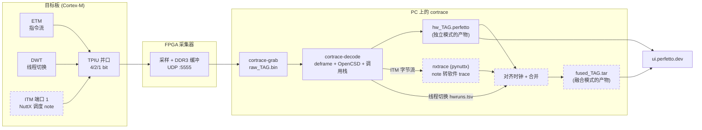
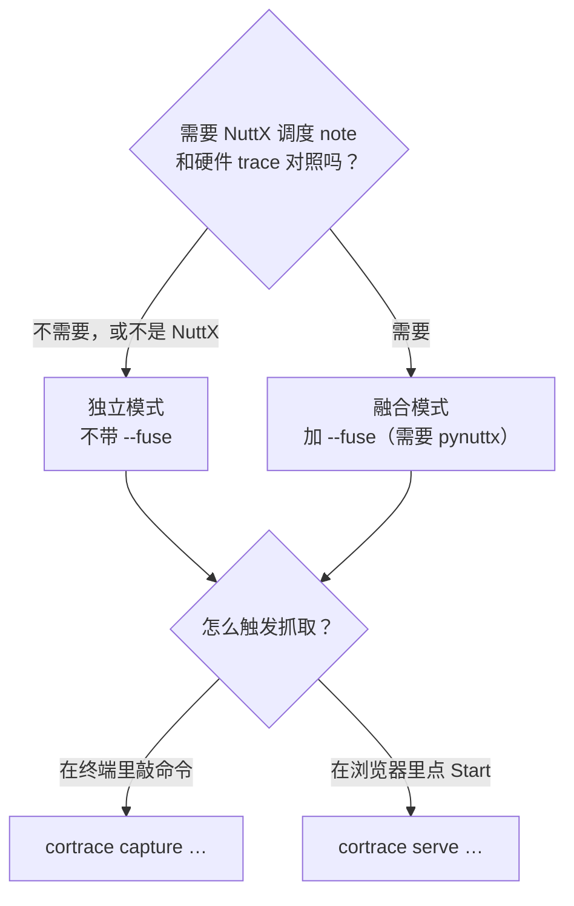
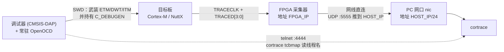
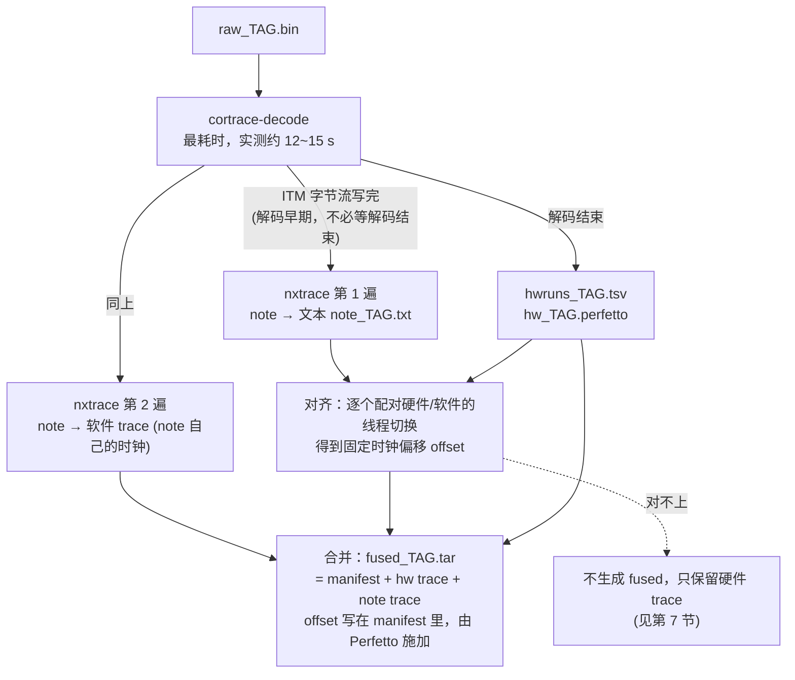
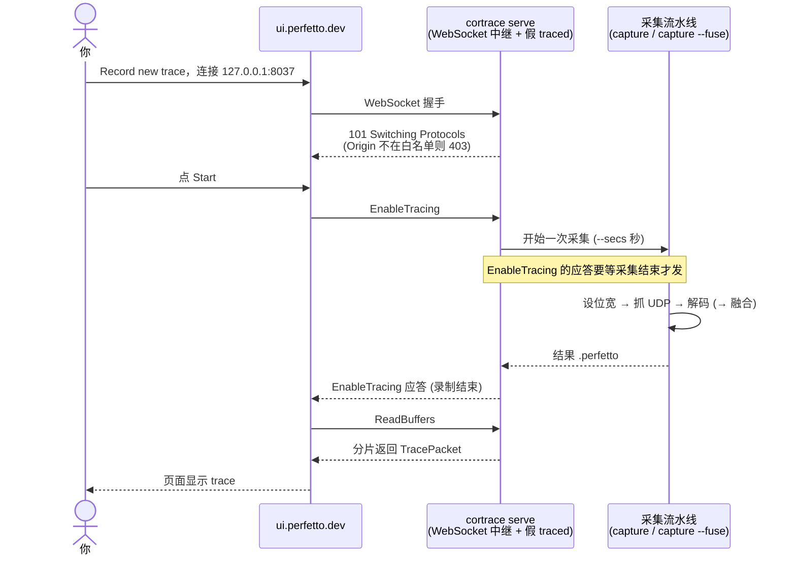
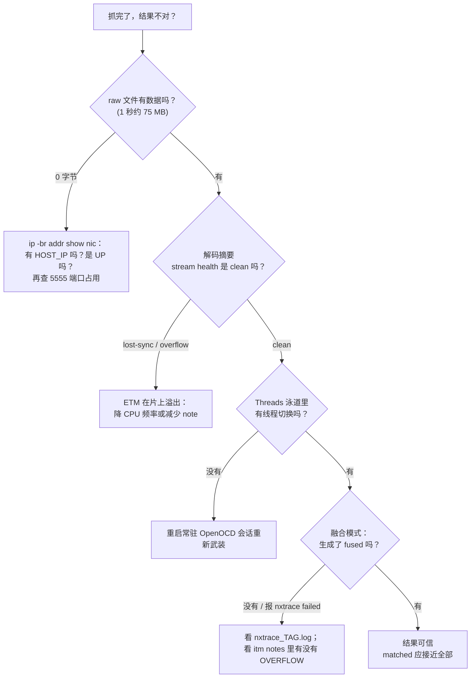

# Cortrace — 使用指南

适用版本：1.0.0 起（Ubuntu 22.04 amd64）。本文按"装好就能用"的顺序写：安装 → 独立模式 → 软硬融合模式 →
网页点击模式 → 排错。文中的数字（耗时、文件大小、匹配率）都来自在干净的 ubuntu:22.04 里用 `apt install`
装好 deb 后，对真实板子（STM32H743 + Artix-7 采集器 + NuttX）实测的结果。

> 设计背景见 [`00-architecture.md`](00-architecture.md)；Record 桥的协议细节见
> [`03-perfetto-record-bridge.md`](03-perfetto-record-bridge.md)；NuttX 融合原理见
> [`02-nxtrace-fusion.md`](02-nxtrace-fusion.md)。

## 1. 两种工作方式

| | 独立模式 | 软硬融合模式 |
|---|---|---|
| 内容 | 硬件 trace：ETM 函数调用栈 + DWT 线程泳道 | 在独立模式之上，再把 NuttX 的调度 note（经 ITM 同一个 TPIU 出来）放到同一条时间轴 |
| 目标固件 | 任意 Cortex-M 固件（裸机、RTOS 均可）；线程泳道需要 NuttX | NuttX，且开启 `CONFIG_ARMV7M_NOTE_ITM` |
| 额外依赖 | 无 | pynuttx（提供 `nxtrace`） |
| 命令 | `cortrace capture` | `cortrace capture --fuse` |
| 产物 | `hw_<tag>.perfetto` | `fused_<tag>.tar`（硬件 + 软件，Perfetto 合并归档；`--merge-format flat` 得到单个 `fused_<tag>.perfetto`） |

两种模式都可以用命令行跑，也可以用 **网页点击模式**（`cortrace serve`）：在 ui.perfetto.dev 的 Record 页面点
Start，抓取、解码、显示一气呵成（见第 5 节）。

数据怎么流动（虚线框是只有融合模式才有的部分）：



选哪种模式、用什么方式触发，两个问题互相独立：



## 2. 开始之前

**硬件链路**

1. 目标板的 ETM / DWT / ITM 必须由调试器配置好，并且**调试器要一直连着**（它持有 `C_DEBUGEN`，否则 NuttX 会把
   DWT 配置清掉）。cortrace 只负责采集和解码，不负责在目标上启用 trace。本仓库的参考做法是
   cortrace-fpga 里的 `nxtrace_rtt.sh`（OpenOCD 常驻会话，启动时打印 `nxtrace_dap: armed`）。
2. FPGA 采集器通过网线直连 PC。采集用的网口需要配置主机地址 `<HOST_IP>`/24（FPGA 往这个地址推 UDP 流，
   端口 5555）。这一步需要 root，而且 `ip addr add` 重启后会丢，**建议一次性配成持久的**，见下面
   "网口地址"一节。主机地址不对时现象是 ARP 正常、但抓到 0 字节。具体地址见 cortrace-fpga 的文档。
3. 准备好固件的 ELF（解码要从 ELF 读指令）。

接线和各自的职责：



**网口地址：配一次，重启后也在**

日常的抓取流程里，**只有这一步需要 sudo**（装 deb 本身要 apt，另说）：`cortrace capture`、`serve`、
`cortrace-grab` 都不需要特权（只有可选的 `cortrace fpga net` ARP 探测需要 `CAP_NET_RAW`）。
给采集网口配地址有两种方式：

- 临时（重启即失效，适合试一下）：

  ```sh
  sudo ip addr add <HOST_IP>/24 dev <nic>
  ```

- 持久（推荐，配一次就行）。桌面版 Ubuntu 用 NetworkManager：

  ```sh
  # 新建一个固定地址、插上网线就自动生效的连接
  sudo nmcli con add type ethernet ifname <nic> con-name cortrace-fpga \
       ipv4.method manual ipv4.addresses <HOST_IP>/24 ipv6.method disabled \
       connection.autoconnect yes
  # 如果已经有一个手动配好的连接，只是没设自动连接：
  sudo nmcli con modify <连接名> connection.autoconnect yes
  ```

  服务器版 Ubuntu 用 netplan（保存为 `/etc/netplan/60-cortrace-fpga.yaml`，然后 `sudo netplan apply`）：

  ```yaml
  network:
    version: 2
    ethernets:
      <nic>:
        dhcp4: false
        dhcp6: false
        addresses: [<HOST_IP>/24]
        optional: true      # 没插采集器时不要拖慢开机
  ```

配完用 `ip -br addr show <nic>` 确认：状态是 `UP`，并且能看到 `<HOST_IP>/24`。注意：

- `<nic>` 用 `enx` 开头的那个名字（由网卡 MAC 生成，重启后不变）；用 `ip -br link` 查。
- 网口 `UP` 要求网线真的接着采集器，没接时是 `NO-CARRIER`，不是地址的问题。
- 不要让别的网口也配到同一个 `/24`，否则内核可能把发给 FPGA 的包从另一个口发出去。
- cortrace 目前**不会**在抓取前检查网口有没有这个地址：地址缺失时的表现就是抓到 0 字节，
  先用上面的 `ip -br addr show <nic>` 排除这一项。

> 这些 `nmcli` / netplan 命令是标准用法，文档里没有在真机上逐条执行；不同发行版或网络管理器的细节
> 以系统自带文档为准。

**软件**：Ubuntu 22.04 amd64。融合模式额外需要 pynuttx 和它的 Python 依赖（第 4 节）。

## 3. 安装

从 [GitHub Releases](https://github.com/FASTSHIFT/cortrace/releases) 下载 `cortrace_<版本>_amd64.deb`：

```sh
sudo apt install ./cortrace_*_amd64.deb
cortrace version          # 例如 1.0.0
```

- 会自动带上 `python3` 和 `binutils-arm-none-eabi`（提供 `arm-none-eabi-nm`）。
- 装进系统的有 `cortrace`、`cortrace-decode`、`cortrace-grab` 三个命令和 Python 包 `cortrace`。
- **不需要任何特权**：`cortrace-grab` 在 Linux ≥ 5.7 上免 root、免 `setcap`。只有 `cortrace fpga net`
  的 ARP 发现需要 `CAP_NET_RAW`，不用它就不需要。
- 卸载：`sudo apt remove cortrace`。

**输出目录必须自己指定**——`--out-dir DIR`，或者一次性 `export CORTRACE_OUT_DIR=DIR`。cortrace 不替你选位置，
也不会自动删除任何文件（原因和磁盘占用见第 6 节）。下文默认已经设好：

```sh
export CORTRACE_OUT_DIR=~/traces
export CORTRACE_IFACE=<nic>         # 采集用的网口，也可以每次写 --iface
```

## 4. 命令行用法

### 4.1 独立模式：只要硬件 trace

```sh
cortrace capture --elf fw.elf --secs 1 --width 4 --tag demo \
                 --time-base hybrid --tsgen-hz 75e6 --tcbmap tcbmap.txt
```

做了什么：把 FPGA 的 TPIU 位宽设为 `--width`（并重新武装）→ 用 `cortrace-grab` 抓 `--secs` 秒 UDP 流到
`raw_<tag>.bin` → `cortrace-decode` 解码 → 写 `hw_<tag>.perfetto`，最后在 stdout 打印这个文件的路径。

实测（1 秒抓取）：原始数据 75 MB，`hw_*.perfetto` 约 355 MB，端到端约 16 秒。解码结束时会打印质量摘要，
**以这两行为准判断这次抓取是否可信**：

```
begins / ends : 6698172 / 6698172  (balanced)
stream health : lost-sync=0 overflow=0 resync(TraceOn)=0 addr-nacc=0 ... -> clean
```

`balanced` 表示调用栈配平；`-> clean` 表示没有丢同步/溢出。出现 `lost-sync` 或 `overflow` 说明 ETM 在片上溢出了
（trace 量超过 TPIU 带宽），解决办法见第 7 节。

常用选项：

| 选项 | 作用 |
|------|------|
| `--time-base cycle`（默认） | 用 ETM 周期计数当时间基，分辨率到 CPU 周期；不需要 `--tsgen-hz` |
| `--time-base etm` | 用 ETM 时间戳（墙钟）；需要 `--tsgen-hz` |
| `--time-base hybrid` | 墙钟时间戳之间用周期数插值，睡眠期间不漂、片段内有周期分辨率；需要 `--tsgen-hz` 和 `--sysclk-hz` |
| `--tsgen-hz` / `--sysclk-hz` | ETM 时间戳时钟 / CPU 时钟（默认 150 MHz） |
| `--tcbmap FILE` | 线程名映射（见下），没有的话线程显示成 `tcb@0x…` |
| `--raw-in FILE` | 不抓取，直接解码一份已有的 raw 文件 |
| `--open` | 完成后在浏览器里打开结果 |
| `--no-banner` | 不打印启动 logo（也可设 `CORTRACE_NO_BANNER=1`；logo 只在终端里显示） |

**线程名映射**：NuttX 的 TCB 在堆上，不在 ELF 里。目标跑起来后，通过常驻的 OpenOCD 读活线程表：

```sh
cortrace tcbmap --elf nuttx --telnet 127.0.0.1:4444 --out tcbmap.txt
```

它只读 `g_pidhash` 里的活条目（只读内存），并且借用已经常驻的 OpenOCD 会话，不会另起一个 OpenOCD
去连调试器——后者会把 DWT 配置清掉。

没有常驻 OpenOCD 时才需要自己指定调试器和芯片的配置文件（工具不内置任何型号）：
`--openocd-config interface/<probe>.cfg --openocd-config target/<chip>.cfg`，或设环境变量
`CORTRACE_OPENOCD_CONFIG="interface/<probe>.cfg target/<chip>.cfg"`。

### 适配别的内核（ETMv4 参数）

`cortrace-decode` 的 ETMv4 参数默认按 Cortex-M7 的 ETMv4 配置。换成别的核时，从目标的
`TRCIDR0/1/2/8/12`、`TRCCONFIGR`、`TRCTRACEIDR` 读出值，用
`--etm-idr0/1/2/8/12`、`--etm-configr`、`--etm-trace-id` 覆盖（`--etm-trace-id` 改了的话，
`--want-stream` 也要跟着改成同一个 ATB id）。

### 4.2 软硬融合模式：硬件 + NuttX 软件 trace

**目标侧**：固件打开 `CONFIG_ARMV7M_NOTE_ITM`（note 走 ITM 刺激端口 1，和 ETM、DWT 共用同一个 TPIU）。

用别的 NuttX 树时有两处可能不同，都能在命令行里指定：

- note 写到哪个 ITM 端口：`--itm-port N`（默认 1；Vela 的 `DRIVERS_NOTEITM` 用端口 0）。
- `NOTE_RESUME` 的数值：上游是 3，开头多一个 `NOTE_ALL` 的树是 4。默认从 `--elf` 的调试信息里读
  （用 `readelf`，和 `--nm` 同目录），读不到才按 3；也可以用 `--resume-type N` 直接指定。

`capture --fuse` 不认识的选项会原样交给 `fuse`，所以这两个选项两边都能用。`cortrace tcbmap` 默认按上游的
TCB 布局读 pid 和入口，布局不同时用 `--pid-off`、`--entry-off`（偏移可以用 gdb 的
`print &((struct tcb_s *)0)->pid` 得到）。

**主机侧**：需要 pynuttx。可以是 pip 装的包，也可以用源码目录：

```sh
pip install construct tqdm lief==0.16.5 cxxfilt pyelftools protobuf   # nxtrace 的依赖
export PYNUTTX=/path/to/pynuttx        # 源码目录；pip 装好 pynuttx 的话不需要
```

然后只多一个 `--fuse`：

```sh
cortrace capture --fuse --elf nuttx --secs 1 --width 4 --tag demo --tcbmap tcbmap.txt
```

流程：解码硬件 trace 的同时，一边从同一份抓取里取出 ITM 上的 note 字节流，交给 `nxtrace` 转成软件 trace（与解码并行），
然后把硬件和软件两侧的线程切换逐个配对，拟合出两个时钟的固定偏移，再把两份 trace 合并到同一条时间轴上
（合并方式见下面"合并格式"）。
各步骤之间的依赖关系（解码最耗时，nxtrace 的两遍转换在它进行的同时就已经开始）：



结束时的对齐摘要：

```
matched   : 6902/6902 hw switches within +/-30 us of one common offset
residual  : mean -0.042 us  sd 0.280 us  min -0.873  max +0.693
fused     : <out-dir>/fused_demo.tar
```

`matched` 是硬件侧线程切换里能和软件 note 配上的数量，实测 6902/6902，残差标准差 0.28 µs。实测端到端约 15 秒，
`fused_*.tar` 约 362 MB。归档写完后 `hw_*.perfetto` 会被删掉（它已经在归档里了）；需要同时保留时加
`--keep-parts`。

输出目录里还会有：`notes_<tag>.bin`（原样的 note 字节流）、`note_<tag>.pftrace`（软件 trace，保持 nxtrace 写出的
原样，在它自己的时钟上；偏移记在归档的 manifest 里）、
`note_<tag>.txt`（note 文本）、`hwruns_<tag>.tsv`（硬件侧线程切换）、`offset_<tag>.txt`（时钟偏移，纳秒）、
`nxtrace_<tag>.log`（nxtrace 的错误输出，出问题先看它）。

对已经抓好的 raw 文件，可以单独融合：

```sh
cortrace fuse --raw raw_demo.bin --elf nuttx --out-dir ~/traces --tag again --tcbmap tcbmap.txt
```

**合并格式**（`--merge-format`，`capture --fuse` 和 `fuse` 都有）：

| | `archive`（默认） | `flat` |
|---|---|---|
| 产物 | `fused_<tag>.tar` | `fused_<tag>.perfetto` |
| 做法 | 一个 TAR：`perfetto_manifest.json` + 硬件 trace + note trace，两份 trace **原封不动**；manifest 把它们记成 `hw`、`note` 两台"机器"，并用 `offset_ns` 声明 note 时钟相对硬件时钟的偏移，由 Perfetto 在加载时施加 | 把 note trace 的时间戳在 protobuf 线格式上平移，重编号 sequence id，追加到硬件文件末尾 |
| 谁来对时间 | Perfetto（官方的 [trace 合并机制](https://perfetto.dev/docs/analysis/merging-traces)） | cortrace 自己改字节 |
| 打开方式 | `trace_processor`、ui.perfetto.dev（较新版本；`cortrace open` 可以直接打开） | 任何能打开 `.perfetto` 的查看器 |
| 适合 | 日常使用 | 旧版查看器；`cortrace serve`（网页点击模式要把 trace 以数据包流的方式送进 UI，TAR 做不到，所以 `serve` 固定用 `flat`） |

归档要把硬件 trace 复制进 TAR，磁盘放不下这一份拷贝时，cortrace 会自动改用 `flat`（原地追加，不多占空间）并给出提示。
两种格式加载到 Perfetto 里的内容完全一样：用同一份数据对比过，切片总数、时间范围和按轨道类型的时间戳/时长指纹逐项一致。

合并本身不依赖 OS，也不依赖调试器的 trace 源，所以也单独提供成命令，任何能产出 Perfetto trace 的工具都可以调用：

```sh
cortrace merge -o merged.tar \
    --trace hw.perfetto,machine=hw \
    --trace note.pftrace,machine=note,offset-ns=-16968614631670
```

第一个 `--trace` 是基准（时间线以它为准），其余的要给 `offset-ns`，含义和 Perfetto manifest 一致：正数表示把这份
trace 往后移。`cortrace fuse` 里的 `offset_<tag>.txt` 是"note 时间减去硬件时间"，写进 manifest 时取负。
`--format flat` 输出单个 `.perfetto`。

偏移也可以不手填：每份 trace 给一个上下文切换日志 `switches=LOG`（每次线程切入一行 `<ns>\t<名字> (pid N)`），
`cortrace merge` 按同一线程的切换配对，拟合出固定偏移并打印残差。入口也可以用 `nxtrace merge`（只是转发）。
怎么让别的 trace（比如 QEMU）接进来，见 [`05-trace-producers.md`](05-trace-producers.md)。

也可以不用 cortrace，直接用 Perfetto 自己的
`trace_processor util merge -o merged.tar --manifest manifest.json a.pftrace b.pftrace`，格式见
[manifest 规范](https://perfetto.dev/docs/reference/perfetto-manifest)。

### 4.3 看结果

- `--open`，或 `cortrace open <文件>`：起一个本机页面把文件交给 ui.perfetto.dev（trace 数据只走本机，不上传）。
- 也可以直接把 `.perfetto` 或 `.tar` 文件拖进 https://ui.perfetto.dev 。
- 融合文件里，硬件轨道（调用栈、`Threads` 线程泳道）和软件轨道（调度、线程）在同一条时间轴上，可以直接对照。

### 4.4 查看 FPGA 版本

`cortrace fpga health` 开头会打印 FPGA 比特流的身份：

```
FPGA design : v1.0.0 (git 1a2b3c4d)
built 2026-10-09 21:30:12 +0800  (BUILD_ID=1791552612)
features: DDR3 ring, stream self-test, run-time port width
(read over the UDP readout port :5001, not JTAG)
```

- 这些值是综合时写进比特流的常量（版本号来自 `cortrace-fpga/VERSION`，加 git 提交和编译时间），
  FPGA 运行时通过 UDP :5001 读出，**不走 JTAG**，也不占采集带宽。
- `built from a modified tree` 表示综合时工作区有未提交的改动；`not a release tag` 表示当时的 HEAD
  不是 `v<VERSION>` tag；`pre-release` 表示 VERSION 带后缀。
- `features` 告诉主机这个比特流实现了什么。比如没有 `pin monitors` 的比特流，`health` 就不会去解读
  TRACECLK / 引脚寄存器（它们是接地的常量），以前会因此误报。
- 旧比特流显示 `no version register`，重新综合（`fpga_flow/build_trace_stream.tcl`）后就有了。

### 4.5 其他命令

| 命令 | 作用 |
|------|------|
| `cortrace decode …` | 直接调用 `cortrace-decode`，参数原样透传（离线分析已 deframe 的数据、`--edges` 校验等） |
| `cortrace align --hw-runs … --note …` | 单独拟合硬件和 note 的时钟偏移 |
| `cortrace fpga ctrl set-width 4` | 设置 FPGA 的 TPIU 位宽并重新武装；还有 `rearm`、`set-bitlen`、`stream-selftest`、`iddr-prbs` |
| `cortrace fpga health [ip] [--check {health,ddr3,blackbox}] [--reset]` | 读 FPGA 的调试寄存器并给出诊断 |
| `cortrace fpga net` | ARP 探测 FPGA 接在哪个网口（需要 `CAP_NET_RAW`） |

## 5. 网页点击模式

```sh
cortrace serve --elf fw.elf --iface <nic> --secs 1 --width 4 [--fuse] [--tcbmap tcbmap.txt]
```

它在本机起一个"假 traced"，浏览器里的 Perfetto 把它当成一个可以录制的目标。点 Start 时，cortrace 自己跑一遍
`capture`（加 `--fuse` 就是融合模式），解码完把结果在**同一个页面**里显示出来。

整个交互过程：



步骤：

1. 运行上面的命令，保持它开着。启动后会打印
   `open https://ui.perfetto.dev -> Record new trace -> Linux -> WebSocket 127.0.0.1:8037, then press Start`。
2. 浏览器打开 https://ui.perfetto.dev ，左侧选 **Record new trace**。
3. 目标选 **Linux system**，连接方式选 **WebSocket**，地址 `127.0.0.1:8037`（默认端口，可用 `--port` 改）。
4. 点 **Start recording**。等几十秒（抓取 1 秒 + 解码；融合模式再多一点），页面会自动切到解码后的 trace。

要点：

- **录制时长由 `--secs` 决定**，不是 UI 里设置的时长。UI 里的时长只影响它自己的计时，不影响抓多久。
- 同一时刻只允许一个采集；上一次还没结束时再点 Start 会被忽略。
- 每次点 Start 都会在输出目录里生成一套新文件（文件名带时间戳），空间不够会直接拒绝，见第 6 节。
- 本机回环监听，且只接受来自 `ui.perfetto.dev` 和 `localhost` 的网页（Origin 检查），别的网页连不上，
  避免随便一个网页就能触发抓取。要放行别的来源用 `--allow-origin`。
- 端口 8037 被别的程序占着（比如另一个 `nxtrace traced`）时 `serve` 会起不来，先停掉那个，或者换 `--port`。

> 已验证的部分：WebSocket 握手、来源（Origin）校验、点 Start 后的服务端流程（见 deb 的冒烟测试和
> `python/tests`）。浏览器里的菜单文字会随 Perfetto UI 的版本略有不同，以实际界面为准。

### 5.1 另一种入口：由 nxtrace 起头，`--companion-cmd` 拉起 cortrace

如果你本来就在用 pynuttx 的 `nxtrace traced`（Perfetto 里点 Start 录 NuttX 软件 trace），可以让它在
**下发设备 START 的同时**，顺手运行一条命令去抓硬件 trace，两边就覆盖同一个时间窗口。这条命令就是
`cortrace capture`：

```sh
python -m nxtrace traced --elf /abs/path/nuttx --ws-port 8037 \
    --companion-cmd "cortrace capture --elf /abs/path/nuttx --out-dir /abs/path/traces \
                     --iface <nic> --secs {secs} --tag {tag} --tcbmap /abs/path/tcbmap.txt" \
    none
```

`cortrace capture` 的选项和直接用时一样：`--iface`（或在启动 nxtrace 的 shell 里设 `CORTRACE_IFACE`，
子进程会继承）、`--out-dir`（或 `CORTRACE_OUT_DIR`）；`{secs}` 超过 5 秒还要加 `--allow-long`。

`--companion-cmd` 的行为（来自 `nxtrace traced --help`）：

- 命令**不经过 shell** 执行：不会展开 `~`、环境变量、管道和重定向，路径一律写绝对路径。
- 命令里的 `{secs}` 和 `{tag}` 会被替换：`{secs}` 是 UI 里设置的录制时长，UI 没设时用 `--companion-secs`
  （默认 1.0 秒）；`{tag}` 是这一次录制的标签，用它给 `cortrace capture --tag` 命名，文件就和 nxtrace
  的记录对得上。
- 命令自己跑到结束，**点 Stop 不会等它**。它的日志和计时记录写在 `/tmp/nxtrace-companion-<tag>.log` 和
  `.json`，抓取没成功先看这里。
- 数据源参数放在最后。当前内核的 note 走 ITM、随硬件抓取一起进来，不需要 nxtrace 另外收数据，所以用
  `none`（只起服务，不收数据）；浏览器里 nxtrace 自己的统计（比如丢包摘要）显示为 0 是正常的，因为没有
  数据经过它。如果你的内核仍然用 RTT 输出 note，换成 `tcp 127.0.0.1:9091`（常驻 OpenOCD 的 RTT 服务）。

结果在 `--out-dir` 里，和直接 `cortrace capture` 的产物一样：硬件 trace 是 `hw_<tag>.perfetto`。命令里加
`--fuse` 就得到 `fused_<tag>.tar`（合并格式见 4.2 节），硬件和软件在同一条时间轴上。和 `cortrace serve` 的区别：

| | `cortrace serve`（第 5 节） | `nxtrace traced --companion-cmd` |
|---|---|---|
| 需要 pynuttx | 只有融合模式需要 | 需要 |
| 抓完的结果 | 回到**同一个页面**里显示 | 在输出目录里，自己打开（`cortrace open` 或拖进 Perfetto） |
| 录制时长 | 由 `--secs` 决定，忽略 UI 的设置 | 取 UI 里的时长，没设用 `--companion-secs` |
| 适合 | 只用 cortrace，想点一下就看到结果 | 已经用 nxtrace 的流程，或者软件 trace 来自 RTT |

注意：两个服务默认都从端口 8037 起（`nxtrace traced` 的 `--ws-port 0` 会从 8037 往上找第一个空闲的），
不要同时用同一个端口；`cortrace serve` 换端口用 `--port`，nxtrace 用 `--ws-port`。

## 6. 磁盘与限制

1 秒抓取的数据量：原始 75 MB + 解码产物约 355 MB，合计约 450 MB。融合模式的归档格式合并时要把硬件 trace 复制进 TAR，峰值会多占约 355 MB，写完后删掉原文件；
放不下时自动改用 `flat`（原地追加）。

- 开始抓取或解码前，cortrace 会按"抓取 ≈ 原始×6、解码 ≈ 原始×5"估算需要的空间，不够直接报错并给出数字，
  不会写到一半才失败。
- 抓取超过 5 秒需要加 `--allow-long`。再长的 trace Perfetto 网页也很难加载。
- cortrace **不会自动删除**任何文件，目录由你管理。

## 7. 排错

抓完发现结果不对时，按这个顺序查（先看抓到没有，再看质量，再看线程，最后看融合）：



具体的现象和处理：

| 现象 | 原因 / 处理 |
|------|-------------|
| `--out-dir is required` | 没指定输出目录：加 `--out-dir`，或 `export CORTRACE_OUT_DIR=…` |
| `capture NIC not given` | 没指定网口：加 `--iface`，或 `export CORTRACE_IFACE=…`（用 `--raw-in` 时不需要） |
| `not enough free space in …` | 输出目录所在磁盘放不下，按提示换目录或清理 |
| `--secs … is longer than 5 s` | 确实要抓更长就加 `--allow-long` |
| `cortrace-grab failed`，或抓到 0 字节 | 先 `ip -br addr show <nic>`：网口没有 `<HOST_IP>`（重启后 `ip addr add` 会丢，见第 2 节"网口地址"）或是 `NO-CARRIER`；再查 5555 端口是否被上一次没退出的抓取占着：`fuser -k 5555/udp` |
| 解码摘要里 `lost-sync` / `overflow` 不为 0 | ETM 在片上溢出：降低 CPU 频率、关掉不需要的 note（syscall/heap），或降低 trace 量。融合模式下 ITM 的 note 也占 TPIU 带宽 |
| 线程名都是 `tcb@0x…` | 没给 `--tcbmap`；用 `cortrace tcbmap` 生成（需要调试器的 OpenOCD 常驻） |
| `nxtrace failed … Last lines of nxtrace_<tag>.log` | pynuttx 或它的依赖没装好（常见是缺 `protobuf`）；报错里带了日志尾部 |
| `nxtrace not found` | 没装 pynuttx 且没指定：`pip install` 它，或 `--pynuttx DIR` / `export PYNUTTX=…` |
| `no note bytes on ITM port 1` | 固件没开 `CONFIG_ARMV7M_NOTE_ITM`，或 ITM 没使能（调试器没武装） |
| `clock alignment failed: no fused file` | 硬件和软件的线程切换序列对不上（丢了 note）。看 `itm notes … OVERFLOW`，降低 note 量后重抓；此时只产出硬件 trace |
| `cortrace fpga health` 提示没有 TRACECLK / 有 `FIRST_ERR` | 目标没在输出 trace 时（比如刚烧完 bitstream）FPGA 看不到时钟，这是空闲状态，输出里是 `[INFO]` 而不是故障；`FIRST_ERR` 是"自上次加载/复位以来的第一个错误"，不带 `--reset` 时只是 `[WARN]`。想知道现在有没有问题：`cortrace fpga health --reset`，开始 trace，再跑一次，没再出现就说明采集链路没问题。**抓取质量最终以解码摘要的 `stream health … clean` 为准** |
| 浏览器连不上 / 连上被拒 | 看 `serve` 的日志：`refusing origin` 说明来源不在白名单；端口被占用见第 5 节 |
| 解码出的 `Threads` 泳道为空 / 没有线程切换 | 调试器的常驻会话退出了，或目标被复位过，DWT 配置没了：重新启动常驻 OpenOCD 会话（它会复位目标并重新武装，日志里能看到 `armed`），再抓 |

## 8. 命令速查

```sh
sudo apt install ./cortrace_*_amd64.deb                       # 安装
export CORTRACE_OUT_DIR=~/traces CORTRACE_IFACE=<nic>          # 一次性设置
cortrace capture --elf fw.elf --secs 1 --width 4 --open        # 独立模式
cortrace capture --fuse --elf nuttx --secs 1 --tcbmap m.txt    # 融合模式
cortrace serve --elf nuttx --fuse --tcbmap m.txt               # 网页点击（浏览器里点 Start）
cortrace tcbmap --elf nuttx --telnet 127.0.0.1:4444 --out m.txt  # 线程名映射
cortrace merge -o m.tar --trace a.perfetto,machine=hw --trace b.pftrace,machine=sw,offset-ns=N  # 合并两份 trace
cortrace --help                                                # 全部命令
```
