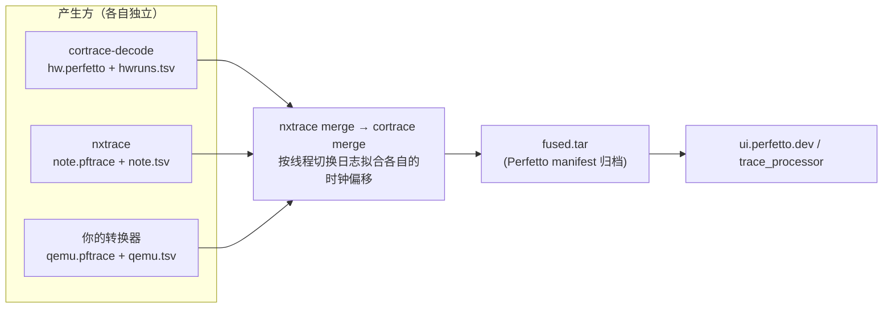

# 接入新的 trace 产生方

这份文档给想把自己的 trace（QEMU、另一种探针、别的 OS 的解析器……）放进同一条时间轴的人。
不需要改 cortrace，也不需要改 nxtrace：约定只有两个文件和一条命令。



入口是 `nxtrace merge`，它只是把参数转发给 `cortrace merge`；两个工具谁都不 import 对方。

## 1. 约定

一个产生方交出两样东西：

**① 一份 Perfetto trace**（标准的 `Trace` protobuf，`.pftrace` / `.perfetto`）

- 时间戳是纳秒，在**它自己的时钟**上，原点任意。不需要和别的 trace 对齐，也不要自己去平移。
- 用什么方式写都可以（TrackEvent、ftrace、自定义轨道……），合并时不会改里面的字节。

**② 一份上下文切换日志**（只在需要自动拟合偏移时才要；自己知道偏移的话可以直接给 `offset-ns`）

文本文件，**每次线程切入一行**，两列用 TAB 分隔：

```
<ns>\t<name> (pid <N>)
```

```
16993507150153	worker_compute (pid 2)
16993507234653	worker_fileio (pid 3)
```

- `<ns>`：整数纳秒，**和上面那份 trace 同一个时钟**。
- 线程用末尾的 `(pid N)` 标识，匹配时只看这个数字；名字只是给人看的，未知可以写 `unknown (pid 7)`。
  只有名字没有 pid 的日志，要配 `--tcbmap`（`cortrace tcbmap` 的输出）把名字映射成 pid。
- 多核时每个 CPU 的切入都写进同一个文件，按时间排序即可（顺序错了也会被排序）。
- 两份日志必须来自**同一次运行**，并且线程的写法一致（同一个线程在两边是同一个 pid）。

## 2. 合并命令

```sh
nxtrace merge -o fused.tar \
    --trace hw.perfetto,machine=hw,switches=hwruns.tsv \
    --trace note.pftrace,machine=note,switches=note.tsv \
    --trace qemu.pftrace,machine=qemu,switches=qemu.tsv
```

- 第一个 `--trace` 是基准，时间线以它为准；每个 `--trace` 要有自己的 `machine=` 名字（Perfetto 里显示成一组）。
- 其余的每份给 `switches=`（拟合）或 `offset-ns=`（自己给，正数表示这份 trace 往后移）。
- 拟合的结果会打印一行：`aligned note to hw: 6904/6904 switches (order), offset … ns, residual sd 0.285 us`。
  `order` 表示两边的切换序列完全一致、逐个配对；`fit` 表示丢过切换、用最近邻拟合。
  **看 `residual sd` 和 `x/y switches`**：对不齐的时候不会报错但数字会很差。
- 输出默认是 TAR + `perfetto_manifest.json`，各份 trace 原样放在里面，偏移由 Perfetto 在加载时施加；
  `--format flat` 输出单个 `.perfetto`。

## 3. 局限

- 只支持**固定偏移**：两个时钟必须是同一个时间基、只差一个原点。时钟速率不同、或者中间有跳变，拟合出的残差
  会很大。需要分段对齐的话要在产生方那一侧把时间戳先换算到同一个时钟上。
- 对齐靠线程切换，所以每份要对齐的 trace 里得有足够多的切换，并且不能是严格周期的（周期负载会让最近邻拟合
  差一个周期；两边切换序列一致时用 `order` 配对不受影响）。
- 合并不改变各份 trace 的内容，也不做去重。

## 4. 接 QEMU 的 qftrace（检查清单）

qftrace 的采集和转换见同事的方案文档（`qftrace 方案验证`、`QEMU 函数级 Trace 方案`）。要接进来，需要在转换器
输出 Perfetto trace 的同时，多写一份切换日志：

1. 记录里有 `icount`、`cpu`、`tid`（读 `g_running_tasks[cpu]` 得到），`.names` 旁车里有 `tid → 任务名`。
2. 对每个 CPU，按记录顺序扫描，**`tid` 变化的那条记录**就是一次切入：写一行
   `<icount×时间换算> \t <任务名> (pid <tid>)`。
3. 时间换算要和 trace 里的时间戳**用同一个系数**（比如 `-icount shift=0` 时 1 条指令 = 1 ns，就都按 1 ns）。
4. 同一次运行里 NuttX 也开了 note（`nxtrace capture --format switches` 生成它那一份日志），两份就可以用
   `nxtrace merge` 对齐了。
5. **需要先确认的一件事**：qftrace 的时间基是 icount，note 的时间戳是客户机自己的时钟。两者在没有空闲
   （WFI）的区间里是同一个速率，但 QEMU 在 `sleep=off` 时遇到空闲会把虚拟时钟直接推进、指令数不动，
   这样全程就不是一个固定偏移。上面的 `x/y switches` 和 `residual sd` 会直接反映这一点；如果残差随时间增大，
   就要在转换器里把 icount 换算到客户机时钟（或者只对齐没有空闲的片段）。这一点我们没有在他的环境里验证过。
6. 验证：`trace_processor` 加载合并后的归档，`SELECT name, value FROM stats WHERE severity = 'error' AND value > 0`
   应当为空（没有因为时钟无法对应而丢事件）。

## 5. 自己写一个产生方的最小例子

```python
# 把任意"(时间, 线程)"序列写成切换日志
with open("mytrace.tsv", "w", encoding="utf-8") as f:
    for ts_ns, tid, name in switches:      # 按时间排序
        f.write(f"{ts_ns}\t{name} (pid {tid})\n")
```

然后 `nxtrace merge -o fused.tar --trace base.pftrace,machine=base,switches=base.tsv --trace mytrace.pftrace,machine=mine,switches=mytrace.tsv`。
