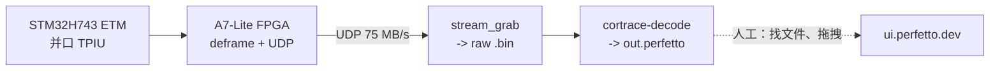
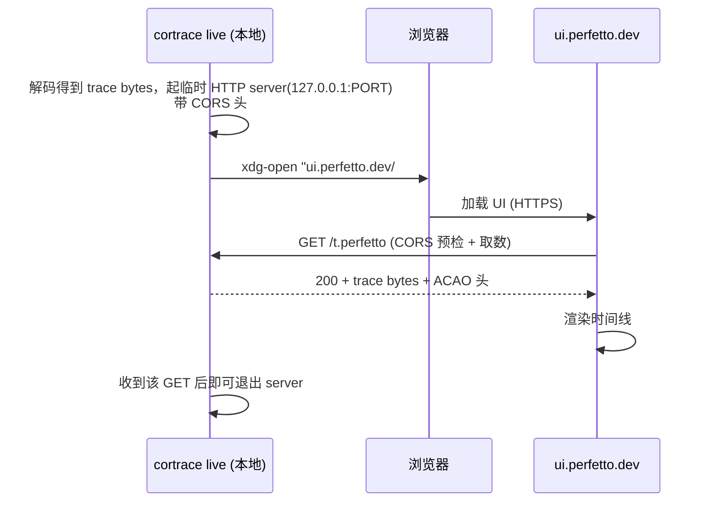
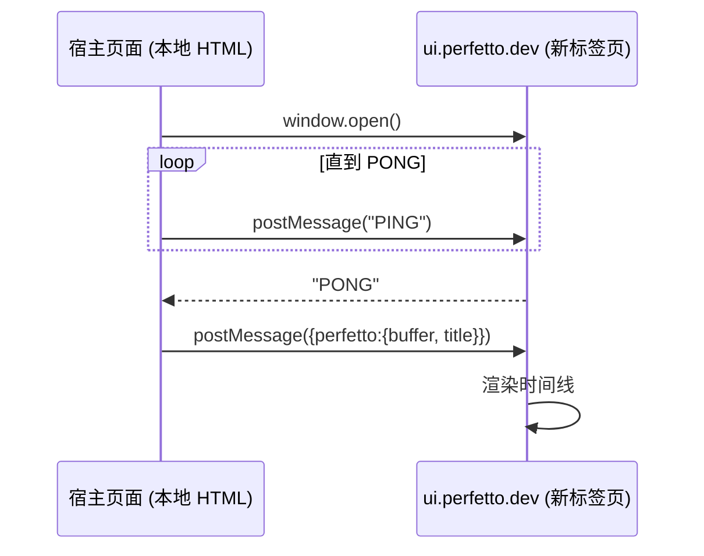
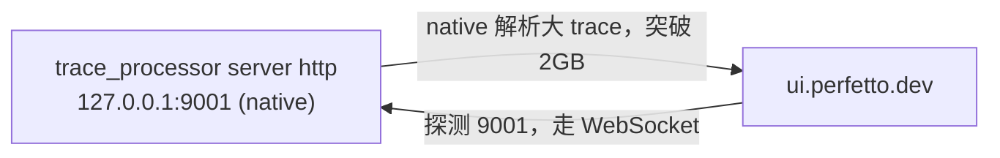
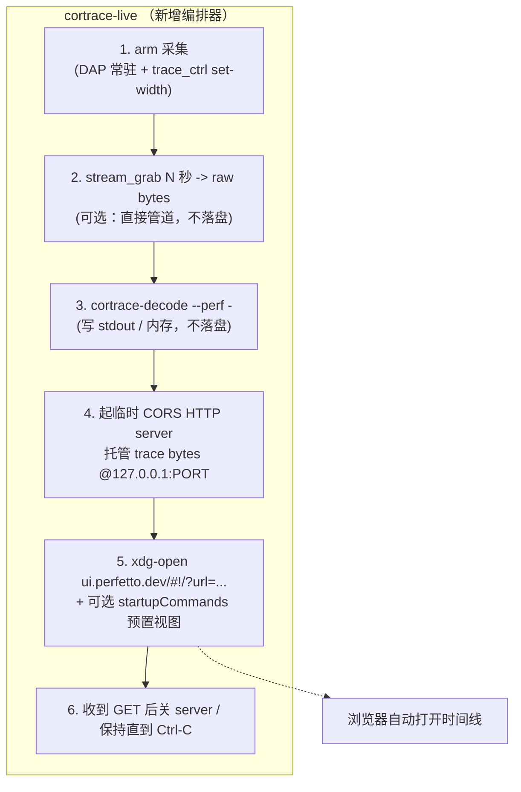
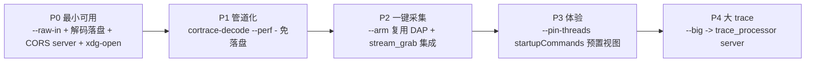

# Cortrace — Perfetto 一键实时可视化桥（设计文档）

> **目标**：把当前"抓包 → 解码成 `.perfetto` 文件 → 手动拖进 ui.perfetto.dev"的三步
> 手工流程，收敛成**一条命令 / 一次点击**：触发采集 → 解码 → 浏览器里自动打开
> Perfetto 时间线，全程不落地文件、不手动拷贝。
>
> **状态**：设计（design）。本文评估 Perfetto 官方支持的本地通信协议，选定方案，
> 给出分阶段落地计划与接口契约。不含实现代码。

---

## 1. 背景与问题

现有端到端链路（doc `cortrace-fpga/docs/01-nuttx-thread-profiling.md`）：



痛点全在最后一跳（虚线）：

- **手工拷贝**：`.perfetto` 落在 `perftrace/`，要手动定位、拖进网页。
- **多次迭代累**：调参数（`--cycle-time` / `--trace-width` / TCB map）后每次都要重拖。
- **大文件卡**：>几百 MB 的 trace，浏览器 WASM 版 TraceProcessor 吃满 2GB 内存会崩。

我们想要的是 TRACE32/J-Trace 那种"点一下 → 出图"的体感，但保留 ui.perfetto.dev
（零安装、始终最新）。

---

## 2. Perfetto 支持的本地通信协议（调研结论）

Perfetto UI 是**纯前端**应用（无自有后端），但官方提供了三条与本地程序对接的通道。
逐条评估：

### 2.1 Direct URL —— `#!/?url=`（本地 HTTP + CORS）

UI 支持 `https://ui.perfetto.dev/#!/?url=<TRACE_URL>`：页面加载后**自己 `fetch()`**
那个 URL 把 trace 拉进浏览器内存渲染。URL 可以指向本机的一个临时 HTTP server。

要求（官方文档）：
- trace 必须能被一个**无查询参数的 GET** 取到；
- server 必须回 CORS 头 `Access-Control-Allow-Origin`（`*` 或 `https://ui.perfetto.dev`）；
- UI 站点是 HTTPS，但它 `fetch` 的目标允许是 `http://127.0.0.1:<port>`（浏览器对
  localhost 的混合内容有豁免）。



- ✅ **最简**：一个 ~30 行的临时 HTTP server + `xdg-open`，无浏览器扩展、无 HTML 页面。
- ✅ **无手工拷贝**、可脚本化、可在 CI 里跑。
- ⚠️ 受浏览器 2GB 内存上限约束（WASM 解析）；大 trace 要配 2.3。
- ⚠️ 需正确的 CORS 头（易错点，见 §6）。

### 2.2 postMessage —— `window.open` + `PING/PONG` + 传 ArrayBuffer

宿主页面 `window.open('https://ui.perfetto.dev')` 拿到 handle，反复 `postMessage('PING')`
直到 UI 回 `'PONG'`，然后 post `{perfetto:{buffer, title, fileName}}` 把 trace 的
**ArrayBuffer 直接塞进去**。数据只在浏览器内存，不经任何 server。



- ✅ 不需要 HTTP server / CORS；能设置标题、文件名。
- ✅ 支持 auth / 自定义分享 URL（我们用不上）。
- ⚠️ 需要一个**本地 HTML 宿主页**跑 JS，且不能从 `file://` 打开（浏览器安全限制），
  仍要一个 localhost HTTP server 托管那个 HTML —— 复杂度反而比 2.1 高。
- ⚠️ 弹窗拦截：`window.open` 必须由用户手势触发且 fetch 不能太久。
- 适合"网页仪表盘"式集成，对我们的 CLI 场景偏重。

### 2.3 TraceProcessor 原生加速 server —— `trace_processor server http`

官方 `trace_processor` 二进制起一个 native server（默认 `127.0.0.1:9001`）。
UI 打开时**探测 9001 端口**，发现后弹窗问是否用本地 WebSocket 加速器替代内置 WASM。
解析在本机原生跑，吃满整机 RAM、SSE 加速。



- ✅ **唯一能解大 trace 的方案**（突破浏览器 2GB；我们 75MB/s 抓 10s 就 ~750MB raw，
  解析后膨胀 2-4x 会撞墙）。
- ✅ 复用同一份 trace 免重复解析（`export perfetto` 归档）。
- ⚠️ 需额外下载 `trace_processor` 二进制；UI 里多一步"用加速器？"确认弹窗。
- 与 2.1/2.2 **正交**：可叠加——URL 打开 UI，同时后台挂 TP server 供大 trace 用。

### 2.4 结论：分层方案

| 方案 | 复杂度 | 无需拷贝 | 大 trace | 依赖 |
|------|:------:|:-------:|:--------:|------|
| 2.1 Direct URL + 本地 CORS server | 低 | ✅ | ❌(2GB) | 无（stdlib http） |
| 2.2 postMessage | 中 | ✅ | ❌(2GB) | 本地 HTML 宿主页 |
| 2.3 TraceProcessor server | 中 | ✅ | ✅ | `trace_processor` 二进制 |

**选型**：
- **主线 = 2.1 Direct URL**：覆盖 95% 日常迭代（trace 通常几十~几百 MB），最简、可脚本、
  零额外依赖。
- **大 trace 档 = 2.3**：`--big` 开关切到 TraceProcessor server 路径。
- **不采用 2.2**：对 CLI 场景它比 2.1 更重（要托管 HTML），收益（auth/分享）我们用不到。

---

## 3. 目标架构

新增一个薄编排层 `cortrace-live`（Python，放 `cortrace-fpga/host/scripts/`，因为它编排
采集 + 解码 + 浏览器，横跨两仓的产物），把现有构件串起来：



关键设计点：

1. **流式免落盘**：`stream_grab | cortrace-decode --perf -`（decode 支持 `-` 写 stdout），
   trace bytes 直接进编排器内存的 buffer，`perftrace/` 落盘变成可选（`--save`）。
   → 需要 cortrace-decode 支持 `--perf -`（见 §5 改动点）。
2. **CORS server 用 stdlib**：Python `http.server` + 覆写 `end_headers` 加 ACAO，
   只服务一个内存 buffer，收到首个成功 GET 即可关闭（或 `--keep` 常驻供刷新）。
3. **startupCommands 预置视图**：URL 里带 `startupCommands`（URL-encoded JSON）自动
   pin 线程轨、跑一条概览 query，省去每次手动操作。例如 pin `Threads` track、
   按名 pin worker 轨。
4. **参数透传**：`--cycle-time/--sysclk-hz/--trace-width/--nx-*` 等 decode 参数原样透传，
   一处配置多处复用。

---

## 4. 命令行接口（草案）

```
cortrace-live [capture opts] [decode opts] [ui opts]

  # 采集
  --iface enxc8a36266dcae     收流网卡
  --secs 1.0                  抓包时长
  --width {4,2,1}             TPIU 端口宽度（同时设 FPGA + 提示 DAP 已配）
  --arm                       抓包前自动 arm（起/复用 DAP 常驻会话）
  --raw-in FILE               跳过采集，直接用已有 raw .bin（离线复现）

  # 解码（透传给 cortrace-decode）
  --elf nuttx --syms x.nm
  --cycle-time --sysclk-hz 150000000
  --nx-switch-stream 1 --nx-tcbmap map.txt

  # 可视化
  --open / --no-open          是否自动开浏览器（默认 open）
  --port 0                    CORS server 端口（0=随机空闲）
  --big                       改走 trace_processor server（大 trace）
  --pin-threads               注入 startupCommands 预置 Threads 轨视图
  --save PATH                 额外落盘一份 .perfetto（默认不落盘）
  --keep                      server 常驻（浏览器可刷新重取），Ctrl-C 退出
```

典型用法：

```bash
# 一键：arm + 抓 1s + 解码 + 开浏览器
./cortrace-live --arm --width 4 --secs 1 \
    --elf ../../../nuttx_test/nuttx/nuttx --syms /tmp/nuttx.syms \
    --cycle-time --sysclk-hz 150000000 --nx-switch-stream 1 --pin-threads

# 离线复现已有 capture
./cortrace-live --raw-in /tmp/o0_150m_4bit.bin --elf nuttx --syms x.nm \
    --cycle-time --sysclk-hz 150000000 --nx-switch-stream 1
```

---

## 5. 对现有代码的改动点

| 组件 | 改动 | 理由 |
|------|------|------|
| `cortrace/tools/cortrace_decode.cpp` | `--perf -` 写 stdout（或 `--perf-fd N`） | 免落盘管道，编排器直接拿 bytes |
| `cortrace-fpga/host/scripts/cortrace-live` | **新增**编排器 | 串采集/解码/浏览器 |
| `cortrace-fpga/host/scripts/stream_grab.c` | 支持 `-`（stdout）输出（可能已支持文件，补 stdout） | 管道化 |
| `nxtrace_dap.cfg` | 无需改 | `--arm` 复用现有 proc |

`--perf -` 是唯一的 cortrace 核心改动，其余都在 host 脚本层，风险低。

---

## 6. 易错点（实现时必看）

- **CORS 头必须齐**：除 `Access-Control-Allow-Origin`，OPTIONS 预检还要
  `Access-Control-Allow-Methods: GET` 和 `Access-Control-Allow-Headers`。少一个 UI 静默拉不到。
- **URL 无查询参数**：UI 要求 trace URL 是「无 query 的 GET」，路径里别带 `?`。
- **不能 `file://`**：postMessage 方案（若将来做）的宿主 HTML 必须经 HTTP server，
  `file://` 会被浏览器安全策略拒。
- **端口固定值冲突**：TraceProcessor 探测写死 `9001`；`--big` 模式端口不可改（UI 只探
  9001，多实例要 `Relax CSP` flag + `?rpc_port=`）。
- **弹窗拦截**（仅 postMessage）：`window.open` 要用户手势触发。Direct URL 用 `xdg-open`
  不受此限。
- **trace bytes 生命周期**：Direct URL 下 UI 是异步 fetch，server 至少要活到那个 GET
  完成；`--keep` 之外的默认模式应等首个成功 GET 再关，不能 open 完立刻退。

---

## 7. 分阶段落地



- **P0** 就能消灭"手动拖文件"这个最大痛点，且不碰 C++ 核心（用已有 `.perfetto` 文件喂
  CORS server 即可），风险最低、先落地。
- **P1** 之后彻底免落盘。
- **P4** 独立，等 trace 真的变大再做。

---

## 8. 验收标准

1. `cortrace-live --raw-in <已知 capture> ...` 在默认浏览器自动打开正确的时间线，
   无需任何手动文件操作。
2. server 在 trace 载入后干净退出（或 `--keep` 常驻），无端口泄漏、无僵尸进程。
3. 解码参数与独立跑 `cortrace-decode` 结果字节一致（编排器不改变解码语义）。
4. `--pin-threads` 打开即见 Threads 轨已 pin、概览 query 已跑。
5. 大 trace（>1GB raw）走 `--big` 能在 TraceProcessor server 下打开而浏览器不崩。

---

## 9. 参考

- Perfetto — Deep linking to the Perfetto UI（`#!/?url=`、postMessage、startupCommands）。
- Perfetto — Embedding the Perfetto UI（PING/PONG postMessage 协议）。
- Perfetto — Visualising large traces（`trace_processor server http`，9001 探测）。
- 内容依据官方文档整理转述，已按许可要求改写。
